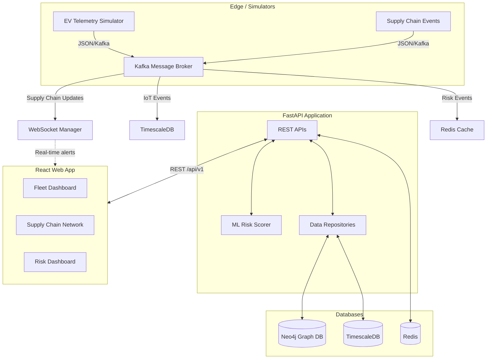
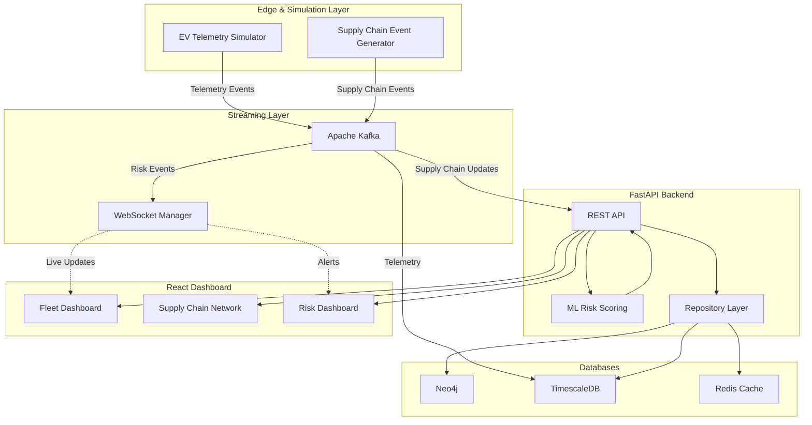
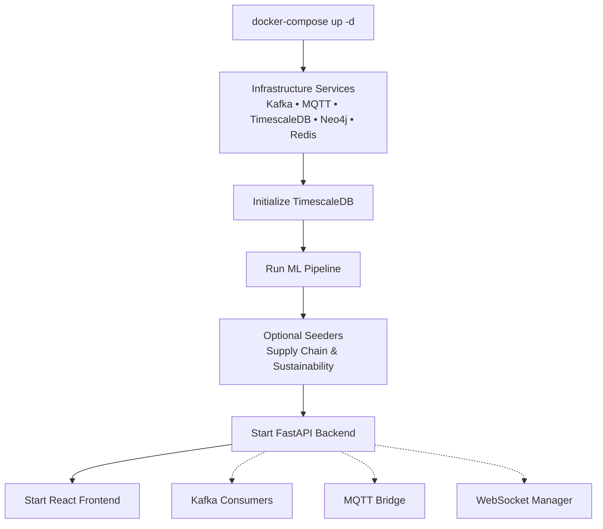

# Industrial EV AI Platform

An advanced AI-driven platform for Industrial EV Battery Lifecycle Management and Supply Chain Traceability.

This prototype demonstrates a full-stack, event-driven architecture combining time-series IoT telematics, graph-based supply chain mapping, real-time Machine Learning risk scoring, and dynamic frontend visualization.

---

## 🏛️ Architecture

The platform relies on a modern, decoupled microservices architecture designed for real-time data ingestion and complex graph traversals.


## 🏛️ Architecture

The platform follows a decoupled microservice architecture for real-time telemetry ingestion, graph analytics, and dashboard visualization.


---

## 🚀 Features

### 1. Battery Lifecycle Management (TimescaleDB)
- **Time-Series Telematics:** High-frequency ingestion of EV battery metrics (SoC, voltage, temperature).
- **Sustainability Tracking:** Calculates battery degradation, carbon footprint, and remaining useful life (RUL).

### 2. Supply Chain Traceability (Neo4j)
- **Multi-Tier Dependency Graph:** Maps Mines ➔ Refineries ➔ Battery Plants ➔ Fleet Vehicles.
- **Material Flow Analysis:** Tracks raw materials (Lithium, Cobalt, Nickel) upstream and downstream.

### 3. AI Risk Scoring & Procurement Recommendations (ML)
- **Real-Time Risk Engine:** Evaluates supplier risk based on geopolitical instability, shipping bottlenecks, and market concentration.
- **Procurement AI:** Recommends alternative suppliers to mitigate critical vulnerabilities.

### 4. Real-Time Event Driven (Kafka + Redis + WebSockets)
- **Cache Invalidation:** Redis caches complex graph traversals to ensure sub-100ms response times. Kafka events instantly invalidate stale caches.
- **Live UI Updates:** WebSockets push live anomaly alerts directly to the React frontend.

---

## 🛠️ Tech Stack

- **Backend:** Python, FastAPI, Pydantic, HTTPX
- **Databases:** Neo4j (Graph), TimescaleDB/PostgreSQL (Time-Series), Redis (Cache)
- **Message Broker:** Apache Kafka / Zookeeper
- **Frontend:** React, TypeScript, Vite, Tailwind CSS, Lucide Icons, Custom SVG Graph Engine
- **Deployment:** Docker Compose

---

## 💻 Running the Project (Verified Startup Sequence)

### 1. Prerequisites
- Docker and Docker Compose installed
- Node.js (v18+) and npm
- Python 3.10+
- Virtual environment support (`venv` or `uv`)

### 2. Environment Setup

It is recommended to use virtual environments for the Python applications.

```bash
# Setup backend environment
cd backend
python -m venv venv
# On Windows: .\venv\Scripts\activate
# On Unix: source venv/bin/activate
pip install -r requirements.txt

# Setup ML environment
cd ../ml
python -m venv venv
# On Windows: .\venv\Scripts\activate
# On Unix: source venv/bin/activate
pip install -r requirements.txt
```

### 3. Runtime Dependency Graph



### 4. Complete Terminal-by-Terminal Startup

The platform requires several processes to run concurrently. Please open 4 separate terminal windows.

| Terminal | Working Directory | Environment | Command | Purpose | Mandatory |
|----------|-------------------|-------------|---------|---------|-----------|
| **Term 1** | Project Root | System | `docker-compose up -d` | Starts all infrastructure services | **Yes** |
| **Term 2** | `backend` | Backend venv | `python -m app.db.init_timescale` | Initializes TimescaleDB schemas | **Yes** |
| **Term 3** | `ml` | ML venv | `python run_all.py` | Trains ML models, generates data | **Yes** |
| **Term 2** | `backend` | Backend venv | `python -m scripts.seed_sustainability`<br>`python -m scripts.seed_supply_chain` | Seeds sustainability and Neo4j supply chain graph data | No |
| **Term 2** | `backend` | Backend venv | `uvicorn app.main:app --host 0.0.0.0 --port 8000 --reload` | Starts the unified API and Streaming engine | **Yes** |
| **Term 4** | `frontend` | System | `npm install`<br>`npm run dev` | Starts the React frontend | **Yes** |

*(Note: The FastAPI backend automatically initializes the MQTT bridge, Kafka producers/consumers, and WebSocket broadcaster during startup.)*

### 5. Runtime Verification

After starting all services, you can verify system health using the following methods:

**1. Infrastructure & Databases:**
- Check Docker: `docker-compose ps`
- Redis: `docker exec -it redis_cache redis-cli ping` (should return PONG)

**2. Backend & API Services:**
- **Health Endpoints:** Navigate to `http://localhost:8000/api/health` and `http://localhost:8000/api/health/neo4j` to verify backend connectivity.
- **Swagger Documentation:** Available at `http://localhost:8000/docs`

**3. Frontend Application:**
- Navigate to `http://localhost:5173` (or the port Vite provides) to interact with the Dashboard, Supply Chain map, and Risk visualizations.

### 6. Shutdown Sequence

To gracefully shut down the application:
1. Stop the Frontend (Ctrl+C in Terminal 4).
2. Stop the Backend (Ctrl+C in Terminal 2).
3. Shut down infrastructure and remove volumes (to reset state):
```bash
docker-compose down -v
```

### 7. Troubleshooting

- **Kafka Connection Errors:** Ensure the `kafka-setup` container has finished executing by checking `docker logs kafka_setup`.
- **Database Initialization Fails:** Verify that `timescaledb` and `neo4j` containers are fully ready before running `init_timescale.py`.
- **Cache/Graph Synchronization Issues:** Restarting the backend (`Term 2`) will often resolve transient state inconsistencies if the cache was polluted prior to Neo4j readiness.
- **Windows `NotImplementedError` (Loop Policy Issues):** On Windows, `aiomqtt` requires `SelectorEventLoop` instead of the default `ProactorEventLoop`. The repository includes a `sitecustomize.py` file to automatically patch this. To ensure uvicorn subprocesses correctly pick it up during hot-reloads, always run the server with the `PYTHONPATH` environment variable set to the `backend` directory (e.g. `$env:PYTHONPATH="backend"` in PowerShell, or `set PYTHONPATH=backend` in CMD, or `PYTHONPATH=backend` on Unix/Git Bash).

---

## 📚 API Reference Overview

A full interactive OpenAPI specification is available at `http://localhost:8000/docs`. Key namespaces include:

- **`/api/v1/sustainability/*`**: TimescaleDB endpoints for fleet carbon tracking and battery health.
- **`/api/v1/supply-chain/dashboard/*`**: Cached Neo4j graph aggregates.
- **`/api/v1/supply-chain/traceability`**: Deep-traversal material lineage.
- **`/api/v1/supply-chain/risk`**: ML-generated risk metrics.
- **`/api/v1/supply-chain/recommendations`**: Procurement diversification suggestions.
