# Industrial EV AI Platform

An enterprise-grade, end-to-end Industrial IoT (IIoT) analytics and intelligence platform designed for electric vehicle (EV) fleet asset monitoring, predictive maintenance, supply chain graph analysis, and carbon accounting.

---

## 🏗️ System Architecture

The platform is designed around a decoupled, highly scalable event-driven architecture to support sub-second telemetry ingestion, graph traversal, and ML inference.

```mermaid
graph TD
    %% Telemetry Stream Ingestion
    subgraph Data Generation & Ingestion
        Sim[EV Telemetry Simulator] -->|MQTT Publish| Mosquitto[Eclipse Mosquitto Broker]
        Mosquitto -->|ev/battery/*| KP[Kafka Producer Bridge]
        KP -->|Event Ingestion| Kafka[Apache Kafka Broker]
    end

    %% Storage & Streaming Analytics
    subgraph Data Storage & Real-Time Processing
        Kafka -->|Kafka Consumer| TSDB[(TimescaleDB hypertable)]
        Kafka -->|Live WebSockets| FastAPI[FastAPI Web Server]
    end

    %% Databases & Models
    subgraph Data Models & Intelligence
        FastAPI -->|REST API & Cypher Queries| Neo4j[(Neo4j Graph Database)]
        FastAPI -->|ML Feature Vector| ML[Predictive AI Engine]
        ML -->|Isolation Forest| Anom[Anomaly Detection]
        ML -->|XGBoost| RUL[Remaining Useful Life]
    end

    %% Presentation Layer
    subgraph Presentation
        FastAPI -->|WebSocket & JSON APIs| React[React + TS Dashboard]
    end

    classDef db fill:#2f3b52,stroke:#4f5d75,stroke-width:2px;
    classDef broker fill:#1f3322,stroke:#2a5c37,stroke-width:2px;
    classDef engine fill:#3d1a3d,stroke:#732973,stroke-width:2px;
    class TSDB,Neo4j db;
    class Mosquitto,Kafka broker;
    class ML,Anom,RUL engine;

```



---

## 🌟 Key Platform Capabilities

### 1. High-Throughput Telemetry Streaming

* Continuous state transmission (Voltage, Current, State of Charge, Core temperature) via **MQTT**.
* Buffered event ingestion using **Apache Kafka** partitioned topic distributions.
* Timeseries persistence leveraging **TimescaleDB** hypertables with dynamic temporal indexing and range-partition optimizations.

### 2. Battery & Predictive Maintenance Intelligence

* **State of Health (SoH) Analytics:** Tracks capacity fade using cumulative discharge integration (Ah depletion curves).
* **Remaining Useful Life (RUL) Forecasting:** Predicts cycles remaining until battery capacity falls below the 80% degradation threshold using **XGBoost regression**.
* **Anomaly Diagnostics:** Identifies thermal runaways and cell-level voltage imbalances using unsupervised **Isolation Forest models**.

### 3. Supply Chain Graph Analytics

* Maps multi-tier mineral dependencies (Mine ➔ Refiner ➔ Battery Plant ➔ Assembly Pack ➔ Fleet Vehicle) using **Neo4j Graph Database**.
* Propagates cascading risks (geopolitical instability, shipping bottlenecks, and material shortage) along supply chains utilizing optimized Cypher graph traversal algorithms.

### 4. Carbon & Electrification Analytics

* Displaces direct Scope-1 combustion emissions vs Scope-3 charging grid emissions (based on local carbon intensity coefficients).
* Calculates EV conversion suitability scores for internal combustion engine (ICE) routes based on payload, travel distances, charging station density, and depot dwell times.

---

## 🛠️ Tech Stack Alignment

| Layer | Technologies | Key Functionality |
| --- | --- | --- |
| **Frontend UI** | React 18, TypeScript, TailwindCSS, ShadCN UI, Recharts, React-Leaflet (v4) | Control dashboard views, responsive metrics widgets, live WebSocket visualization, dark-mesh maps |
| **API Backend** | FastAPI, SQLAlchemy, Pydantic, Uvicorn | REST endpoints, Swagger/OpenAPI documentation, WebSocket gateways |
| **Databases** | TimescaleDB (PostgreSQL), Neo4j Graph Database | Scalable telemetry timeseries, multi-tier dependency mapping |
| **Event Pipeline** | Eclipse Mosquitto (MQTT), Apache Kafka, Zookeeper | Sub-second telemetry publisher/subscriber and streaming queues |
| **AI/ML Stack** | NumPy, Pandas, Scikit-Learn, XGBoost | Data preprocessing, anomaly isolation, RUL regression forecasts |

---

## 📂 Repository Folder Layout

```
├── .gitignore                      # Python, Node, environment configurations ignore
├── docker-compose.yml              # Local infrastructure stack (TimescaleDB, Neo4j, MQTT, Kafka)
├── README.md                       # This document
├── frontend/                       # React + TS + TailwindCSS Dashboard UI
│   ├── package.json                # Frontend package dependencies
│   ├── tsconfig.json               # TypeScript compiler config
│   ├── tailwind.config.js          # Tailwind theme configurations
│   ├── components.json             # ShadCN UI components config
│   ├── src/
│   │   ├── components/             # Reusable UI widgets (gauges, alerts panels)
│   │   ├── layouts/                # Dashboard sidebar and navbar shell
│   │   ├── pages/                  # Route views (Fleet, Battery, Supply Chain, Carbon, Alerts)
│   │   └── router/                 # React Router definition mappings
├── backend/                        # FastAPI Web API Backend
│   ├── requirements.txt            # Python web server dependencies
│   ├── app/
│   │   ├── main.py                 # FastAPI core initializations & configurations
│   │   ├── models/                 # SQLAlchemy schemas (telemetry, charging logs)
│   │   ├── schemas/                # Pydantic serialization models
│   │   └── api/                    # Routers (health, live telemetry, ML, Neo4j supply chain)
├── ml/                             # ML Analytics & Synthetic Data Ingestion
│   ├── requirements.txt            # Data science packages
│   ├── notebooks/                  # EDA, NASA battery dataset profiling, model files
│   ├── src/                        # Preprocessing pipelines (thermal variance, discharge slope)
│   └── simulator/                  # Paho-MQTT based synthetic telemetry stream simulator
└── infrastructure/                 # Databases, brokers, and streaming configurations
    ├── timescaledb/                # Hypertable init scripts & partitioning queries
    ├── neo4j/                      # Cypher query imports & relationship setup
    ├── kafka/                      # Kafka producers & consumers
    └── mosquitto/                  # MQTT broker configurations

```

---

## 🚀 Environment Launch Instructions

### 1. Infrastructure Setup

Spin up the local containerized databases, brokers, and event pipelines:

```bash
docker-compose up -d

```

*(Optional: Verify Kafka topics are created by checking the setup logs: `docker logs -f kafka_setup`)*

### 2. Initialize TimescaleDB Hypertables

From the backend directory, provision your IoT tracking schemas:

```bash
cd backend
python -m app.db.init_timescale

```

### 3. Backend Setup

```bash
cd backend
python -m venv .venv
source .venv/bin/activate  # On Windows: .venv\Scripts\activate
pip install -r requirements.txt
uvicorn app.main:app --reload

```

*Access the API documentation at [http://localhost:8000/docs](http://localhost:8000/docs).*

### 4. Frontend Setup

```bash
cd frontend
npm install
npm run dev

```

*Access the control dashboard interface at [http://localhost:3000](http://localhost:3000).*

### 5. Running the End-to-End Pipeline

Open three separate terminal windows, activate your virtual environment, and execute these components in order to see telemetry route in real-time:

* **Terminal 1 (Destination Database Engine):** `python infrastructure/kafka/consumers/db_writer.py`
* **Terminal 2 (MQTT-to-Kafka Stream Router):** `python infrastructure/kafka/mqtt_kafka_bridge.py`
* **Terminal 3 (Synthetic Sensor Stream Simulator):** `python ml/simulator/simulator.py`

---

## 🖥️ What to Expect: Frontend Live Experience

Once your environment is completely launched and the backend simulators are broadcasting data, the frontend application provides a high-fidelity workspace:

### 📊 Real-Time Telemetry Performance Counters

* **Ingestion Metrics:** The upper banner displays a live processing widget displaying real-time text such as `Ingesting: 4 Telemetry msg/sec`. This guarantees the active telemetry pipeline is communicating correctly.
* **Synchronized States:** The **Active Assets**, **Average SoC**, and **Health Index** panels update instantly as new frames land from the network thread.

### 🗺️ Live Dark-Mesh Geospatial Telemetry Map

* **Automatic Viewport Centering:** The integrated map dynamically handles multi-vehicle tracking bounds via an automated map bounding-box algorithm (`MapUpdater`). It automatically centers and pans around your live active vehicles.
* **Interactive Layer Markers:** Map markers override default legacy graphics with modern glowing DOM circles containing animated custom ping rings indicating live connectivity.
* **Dynamic Status Coloring:** Healthy nodes render in **Emerald Green**, while any asset suffering structural anomalies (e.g., motor temperatures crossing over `40.0°C`) automatically updates its state inside the state engine, instantly rendering as a **Blinking Red Alert Marker** on the canvas. Clicking any marker reveals an analytical diagnostic pop-up block.

### 📋 Fleet Telemetry Data Grid

* The main interface features an exhaustive asset grid logging **Speed**, **Exact Location Coordinates**, **Motor Temperatures**, and **Torque Loads**.
* Columns update dynamically without interface stuttering or full-page rendering cycles, featuring colored indicators mapping back to warning flags.

```
