# Industrial EV AI Platform

An enterprise-grade, end-to-end Industrial IoT (IIoT) analytics and intelligence platform designed for electric vehicle (EV) fleet asset monitoring, predictive maintenance, supply chain graph analysis, and carbon accounting.

---

## 🏗️ System Architecture

The platform is designed around a decoupled, highly scalable event-driven architecture to support sub-second telemetry ingestion, graph traversal, and ML inference.

```mermaid
graph TD
    %% Telemetry Stream Ingestion
    subgraph Data Generation & Ingestion
        Sim[EV Telemetry Simulator] -->|MQTT Publish| Mosquitto[Eclipse Mosquitto Broker]
        Mosquitto -->|ev/battery/*| KP[Kafka Producer Bridge]
        KP -->|Event Ingestion| Kafka[Apache Kafka Broker]
    end

    %% Storage & Streaming Analytics
    subgraph Data Storage & Real-Time Processing
        Kafka -->|Kafka Consumer| TSDB[(TimescaleDB hypertable)]
        Kafka -->|Live WebSockets| FastAPI[FastAPI Web Server]
    end

    %% Databases & Models
    subgraph Data Models & Intelligence
        FastAPI -->|REST API & Cypher Queries| Neo4j[(Neo4j Graph Database)]
        FastAPI -->|ML Feature Vector| ML[Predictive AI Engine]
        ML -->|Isolation Forest| Anom[Anomaly Detection]
        ML -->|XGBoost| RUL[Remaining Useful Life]
    end

    %% Presentation Layer
    subgraph Presentation
        FastAPI -->|WebSocket & JSON APIs| React[React + TS Dashboard]
    end

    classDef db fill:#2f3b52,stroke:#4f5d75,stroke-width:2px;
    classDef broker fill:#1f3322,stroke:#2a5c37,stroke-width:2px;
    classDef engine fill:#3d1a3d,stroke:#732973,stroke-width:2px;
    class TSDB,Neo4j db;
    class Mosquitto,Kafka broker;
    class ML,Anom,RUL engine;

```



---

## 🌟 Key Platform Capabilities

### 1. High-Throughput Telemetry Streaming
*   Continuous state transmission (Voltage, Current, State of Charge, Core temperature) via **MQTT**.
*   Buffered event ingestion using **Apache Kafka** partitioned topic distributions.
*   Timeseries persistence leveraging **TimescaleDB** hypertables with dynamic temporal indexing and range-partition optimizations.

### 2. Battery & Predictive Maintenance Intelligence
*   **State of Health (SoH) Analytics:** Tracks capacity fade using cumulative discharge integration (Ah depletion curves).
*   **Remaining Useful Life (RUL) Forecasting:** Predicts cycles remaining until battery capacity falls below the 80% degradation threshold using **XGBoost regression**.
*   **Anomaly Diagnostics:** Identifies thermal runaways and cell-level voltage imbalances using unsupervised **Isolation Forest models**.

### 3. Supply Chain Graph Analytics
*   Maps multi-tier mineral dependencies (Mine ➔ Refiner ➔ Battery Plant ➔ Assembly Pack ➔ Fleet Vehicle) using **Neo4j Graph Database**.
*   Propagates cascading risks (geopolitical instability, shipping bottlenecks, and material shortage) along supply chains utilizing optimized Cypher graph traversal algorithms.

### 4. Carbon & Electrification Analytics
*   Displaces direct Scope-1 combustion emissions vs Scope-3 charging grid emissions (based on local carbon intensity coefficients).
*   Calculates EV conversion suitability scores for internal combustion engine (ICE) routes based on payload, travel distances, charging station density, and depot dwell times.

---

## 🛠️ Tech Stack Alignment

| Layer | Technologies | Key Functionality |
| :--- | :--- | :--- |
| **Frontend UI** | React, TypeScript, TailwindCSS, ShadCN UI, Recharts | Control dashboard views, responsive metrics widgets, live WebSocket visualization |
| **API Backend** | FastAPI, SQLAlchemy, Pydantic, Uvicorn | REST endpoints, Swagger/OpenAPI documentation, WebSocket gateways |
| **Databases** | TimescaleDB (PostgreSQL), Neo4j Graph Database | Scalable telemetry timeseries, multi-tier dependency mapping |
| **Event Pipeline** | Eclipse Mosquitto (MQTT), Apache Kafka, Zookeeper | Sub-second telemetry publisher/subscriber and streaming queues |
| **AI/ML Stack** | NumPy, Pandas, Scikit-Learn, XGBoost | Data preprocessing, anomaly isolation, RUL regression forecasts |

---

## 📂 Repository Folder Layout

```
├── .gitignore                      # Python, Node, environment configurations ignore
├── docker-compose.yml              # Local infrastructure stack (TimescaleDB, Neo4j, MQTT, Kafka)
├── README.md                       # This document
├── frontend/                       # React + TS + TailwindCSS Dashboard UI
│   ├── package.json                # Frontend package dependencies
│   ├── tsconfig.json               # TypeScript compiler config
│   ├── tailwind.config.js          # Tailwind theme configurations
│   ├── components.json            # ShadCN UI components config
│   ├── src/
│   │   ├── components/             # Reusable UI widgets (gauges, alerts panels)
│   │   ├── layouts/                # Dashboard sidebar and navbar shell
│   │   ├── pages/                  # Route views (Fleet, Battery, Supply Chain, Carbon, Alerts)
│   │   └── router/                 # React Router definition mappings
├── backend/                        # FastAPI Web API Backend
│   ├── requirements.txt            # Python web server dependencies
│   ├── app/
│   │   ├── main.py                 # FastAPI core initializations & configurations
│   │   ├── models/                 # SQLAlchemy schemas (telemetry, charging logs)
│   │   ├── schemas/                # Pydantic serialization models
│   │   └── api/                    # Routers (health, live telemetry, ML, Neo4j supply chain)
├── ml/                             # ML Analytics & Synthetic Data Ingestion
│   ├── requirements.txt            # Data science packages
│   ├── notebooks/                  # EDA, NASA battery dataset profiling, model files
│   ├── src/                        # Preprocessing pipelines (thermal variance, discharge slope)
│   └── simulator/                  # Paho-MQTT based synthetic telemetry stream simulator
└── infrastructure/                 # Databases, brokers, and streaming configurations
    ├── timescaledb/                # Hypertable init scripts & partitioning queries
    ├── neo4j/                      # Cypher query imports & relationship setup
    ├── kafka/                      # Kafka producers & consumers
    └── mosquitto/                  # MQTT broker configurations
```

---

### 2. Infrastructure Setup
Spin up the local containerized databases, brokers, and event pipelines (including auto-provisioning Kafka topics):
```bash
docker-compose up -d

```

*(Optional: Verify Kafka topics are created by checking the setup logs: `docker logs -f kafka_setup`)*

### 3. Backend Setup

```bash
cd backend
python -m venv .venv
source .venv/bin/activate  # On Windows: .venv\Scripts\activate
pip install -r requirements.txt
uvicorn app.main:app --reload

```

*Access the API documentation at [http://localhost:8000/docs](http://localhost:8000/docs).*

### 4. Frontend Setup

```bash
cd frontend
npm install
npm run dev

```

*Access the control dashboard interface at [http://localhost:3000](http://localhost:3000).*

### 5. End-to-End Infrastructure Pipeline Test

To test the flow of data from generation to Kafka consumption, configure a Python virtual environment at the project root:

```bash
# Create and activate the virtual environment
python3 -m venv venv
source venv/bin/activate  # On Windows: venv\Scripts\activate

# Install messaging dependencies
pip install paho-mqtt kafka-python numpy

```

Open **three separate terminal windows**, activate the virtual environment (`source venv/bin/activate`) in each, and run the following services in order:

**Terminal 1: Start the Kafka Consumer (Destination)**

```bash
python infrastructure/kafka/consumers/telemetry_consumer.py

```

**Terminal 2: Start the MQTT-to-Kafka Bridge (Router)**

```bash
python infrastructure/kafka/mqtt_kafka_bridge.py

```

**Terminal 3: Start the Data Simulator (Source)**

```bash
python ml/simulator/simulator.py

```


# Telemetry & Time-Series Service

The **Telemetry & Time-Series Service** is responsible for ingesting, processing, storing, and serving real-time Industrial EV telemetry data.

It forms the core data pipeline between the vehicle simulator, messaging infrastructure, database, and frontend dashboard. The service consumes validated telemetry events from Kafka, persists them into **TimescaleDB**, and exposes both REST APIs and WebSocket streams for real-time and historical analytics.

---

# Responsibilities

- Vehicle telemetry ingestion
- Battery metric persistence
- GPS location tracking
- Charging session management
- Historical telemetry retrieval
- Time-series aggregation
- Real-time WebSocket streaming

---

# Architecture

```
                          VEHICLE SIMULATOR
                                 │
                                 ▼
                          MQTT Broker
                                 │
                                 ▼
                     Backend Streaming Layer
               (Validation → Normalization)
                                 │
                                 ▼
                            Kafka Broker
                                 │
              ┌──────────────────┴──────────────────┐
              │                                     │
              ▼                                     ▼
      WebSocket Broadcast                 Telemetry Processor
                                                    │
                                                    ▼
                                             Service Layer
                                                    │
                                                    ▼
                                             Repository Layer
                                                    │
                                                    ▼
                                               TimescaleDB
                                                    │
                                                    ▼
                                               REST APIs
                                                    │
                                                    ▼
                                              Frontend UI
```

---

# Data Flow

```
Simulator
    ↓
MQTT
    ↓
Kafka
    ↓
Telemetry Processor
    ↓
Telemetry Service
    ↓
Repository
    ↓
TimescaleDB
    ↓
REST APIs
```

Live updates are simultaneously broadcast through WebSockets:

```
Kafka Consumer
      │
      ├────────► WebSocket Clients
      │
      └────────► Database Persistence
```

---

# API Endpoints

## Telemetry

| Method | Endpoint | Description |
|---------|----------|-------------|
| POST | `/api/v1/telemetry` | Manual telemetry ingestion (testing/debugging). |
| GET | `/api/v1/telemetry/latest` | Returns the latest telemetry for a vehicle. |
| GET | `/api/v1/telemetry/history` | Returns historical telemetry records. |
| GET | `/api/v1/telemetry/timeseries` | Returns aggregated time-series data for visualization. |

---

## Battery

| Method | Endpoint | Description |
|---------|----------|-------------|
| GET | `/api/v1/battery/latest` | Returns the latest battery metrics for a vehicle. |

---

## Charging

| Method | Endpoint | Description |
|---------|----------|-------------|
| POST | `/api/v1/charging/session` | Starts a charging session. |
| PATCH | `/api/v1/charging/session/{session_id}` | Completes or updates a charging session. |
| GET | `/api/v1/charging/history` | Returns charging history. |

---

## Location

| Method | Endpoint | Description |
|---------|----------|-------------|
| POST | `/api/v1/location` | Manual location ingestion (testing/debugging). |
| GET | `/api/v1/location/latest` | Returns the latest GPS location. |
| GET | `/api/v1/location/history` | Returns historical GPS coordinates. |

---

## WebSocket

| Endpoint | Description |
|----------|-------------|
| `WS /api/v1/ws/telemetry` | Streams live telemetry events to connected dashboard clients. |

---

# Kafka Topics

The Telemetry Service consumes the following Kafka topics:

| Topic | Description |
|--------|-------------|
| `ev.telemetry` | Vehicle telemetry |
| `ev.battery` | Battery metrics |
| `ev.location` | GPS location |
| `ev.charging` | Charging session events |

---

# Database

The service stores data in **TimescaleDB**.

### Hypertables

- `telemetry`
- `location_history`

### Relational Tables

- `charging_sessions`

---

# Service Components

```
telemetry/
│
├── api/
├── models/
├── schemas/
├── repository/
├── services/
├── processors/
└── validators/
```

---

# Processing Pipeline

```
Kafka Consumer
        │
        ▼
Telemetry Processor
        │
        ▼
Telemetry Service
        │
        ▼
Repository Layer
        │
        ▼
TimescaleDB
```

---

# Repository Responsibilities

### Telemetry Repository

- Insert telemetry
- Bulk insert telemetry
- Latest telemetry
- Historical telemetry
- Time-series aggregation

### Charging Repository

- Create charging session
- Update charging session
- Retrieve charging history

### Location Repository

- Store GPS coordinates
- Retrieve latest location
- Retrieve location history

---

# Running the Service

## 1. Start Infrastructure

```bash
cd infrastructure
docker compose up -d
```

---

## 2. Initialize TimescaleDB

```bash
cd backend

python -m app.db.init_timescale
```

---

## 3. Start Backend

```bash
uvicorn app.main:app --reload
```

---

## 4. Start MQTT → Kafka Bridge

```bash
python infrastructure/kafka/mqtt_kafka_bridge.py
```

---

## 5. Start Database Writer

```bash
python infrastructure/kafka/consumers/db_writer.py
```

---

## 6. Start Debug Consumer (Optional)

```bash
python infrastructure/kafka/consumers/telemetry_consumer.py
```

---

## 7. Start Simulator

```bash
python ml/simulator/simulator.py
```

---

# Final Deliverables

At the completion of this module, the Telemetry Service provides:

- MQTT → Kafka → TimescaleDB ingestion pipeline
- Real-time WebSocket streaming
- Telemetry persistence
- Charging session management
- GPS location tracking
- Historical telemetry queries
- Time-series aggregation APIs
- REST APIs for telemetry, charging, battery, and location
- TimescaleDB optimized for high-frequency IoT data
