# Project Dump

Project: industrial-ev-ai-platform

## Directory Tree

```text
industrial-ev-ai-platform
├── .gitignore
├── backend
│   ├── app
│   │   ├── api
│   │   │   └── v1
│   │   │       ├── api.py
│   │   │       └── endpoints
│   │   │           ├── health.py
│   │   │           ├── ml_inference.py
│   │   │           ├── supply_chain.py
│   │   │           ├── sustainability.py
│   │   │           └── telemetry.py
│   │   ├── main.py
│   │   ├── models
│   │   │   └── relational.py
│   │   └── schemas
│   │       └── telemetry.py
│   └── requirements.txt
├── docker-compose.yml
├── frontend
│   ├── components.json
│   ├── index.html
│   ├── package.json
│   ├── postcss.config.js
│   ├── src
│   │   ├── App.tsx
│   │   ├── index.css
│   │   ├── layouts
│   │   │   └── DashboardLayout.tsx
│   │   ├── main.tsx
│   │   ├── pages
│   │   │   ├── Alerts.tsx
│   │   │   ├── BatteryAnalytics.tsx
│   │   │   ├── CarbonAnalytics.tsx
│   │   │   ├── FleetOverview.tsx
│   │   │   └── SupplyChain.tsx
│   │   └── router
│   │       └── index.tsx
│   ├── tailwind.config.js
│   ├── tsconfig.json
│   └── vite.config.ts
├── infrastructure
│   ├── kafka
│   │   ├── consumers
│   │   │   ├── db_writer.py
│   │   │   └── telemetry_consumer.py
│   │   └── mqtt_kafka_bridge.py
│   ├── mosquitto
│   │   └── mosquitto.conf
│   ├── neo4j
│   │   ├── init_db.py
│   │   └── init_graph.cypher
│   └── timescaledb
│       └── init.sql
├── ml
│   ├── notebooks
│   │   └── README.md
│   ├── requirements.txt
│   ├── simulator
│   │   └── simulator.py
│   └── src
│       └── preprocessing.py
├── project_dump.md
└── README.md
```

# File Contents

---

## .gitignore

```
# Prerequisites
*.d

# Byte-compiled / optimized / DLL files
__pycache__/
*.py[cod]
*$py.class

# C extensions
*.so

# Distribution / packaging
.Python
build/
develop-eggs/
dist/
downloads/
eggs/
.eggs/
lib/
lib64/
parts/
sdist/
var/
wheels/
share/python-wheels/
*.egg-info/
.installed.cfg
*.egg
MANIFEST

# PyInstaller
#  Usually these files are written by a python script from a template
#  before PyInstaller builds the exe, so as to inject date/other infos into it.
*.manifest
*.spec

# Installer logs
pip-log.txt
pip-delete-this-directory.txt

# Unit test / coverage reports
htmlcov/
.tox/
.nox/
.coverage
.coverage.*
.cache
nosetests.xml
coverage.xml
*.cover
*.py,cover
.hypothesis/
.pytest_cache/
cover/

# Translations
*.mo
*.pot

# Django stuff:
*.log
local_settings.py
db.sqlite3
db.sqlite3-journal

# Sphinx documentation
docs/_build/

# PyBuilder
.pybuilder/
target/

# Jupyter Notebook
.ipynb_checkpoints

# IPython
profile_default/
ipython_config.py

# pyenv
#   For a library or package, you might want to ignore these files since the code is
#   intended to run in multiple environments; otherwise, check them in:
# .python-version

# pipenv
#   According to pypa/pipenv#1255, pipenv should generally check in Pipfile.lock.
#   For libraries, check in Pipfile.lock.
# Pipfile.lock

# poetry
#   Similar to Pipenv, poetry.lock should be checked in for applications.
# poetry.lock

# pdm
#   Similar to Pipenv, pdm.lock should be checked in for applications.
# pdm.lock

# virtualenv
.venv
venv/
ENV/
env/

# Spyder project settings
.spyderproject
.spyproject

# Rope project settings
.ropeproject

# mkdocs documentation
/site

# mypy
.mypy_cache/
.dmypy.json
dmypy.json

# Pyre type checker
.pyre/

# pytype
.pytype/

# Cython debug symbols
cython_debug/

# Node modules & frontend artifacts
node_modules/
/frontend/dist
/frontend/build
.eslintcache
.stylelintcache
*.local
.env
!.env.example

# IDEs
.vscode/
.idea/
*.suo
*.ntvs*
*.njsproj
*.sln
*.sw?

# Database/Infrastructure Data
infrastructure/data/
neo4j/data/
timescaledb/data/
kafka/data/
mosquitto/data/
data/

# OS metadata
.DS_Store
Thumbs.db
```

---

## docker-compose.yml

```yaml
services:
  # TimescaleDB (PostgreSQL with Time-series extension)
  timescaledb:
    image: timescale/timescaledb:latest-pg15
    container_name: ev_platform_timescaledb
    environment:
      POSTGRES_USER: postgres
      POSTGRES_PASSWORD: postgrespassword
      POSTGRES_DB: ev_platform
    ports:
      - "5432:5432"
    volumes:
      - timescale_data:/var/lib/postgresql/data
      - ./infrastructure/timescaledb/init.sql:/docker-entrypoint-initdb.d/init.sql
    restart: unless-stopped

  # Neo4j Graph Database (Supply Chain Dependency Graph)
  neo4j:
    image: neo4j:5.12.0-community
    container_name: ev_platform_neo4j
    ports:
      - "7474:7474" # HTTP Dashboard
      - "7687:7687" # Bolt protocol
    environment:
      NEO4J_AUTH: neo4j/neo4jpassword
    volumes:
      - neo4j_data:/data
      - neo4j_logs:/logs
      - ./infrastructure/neo4j:/var/lib/neo4j/import
    restart: unless-stopped

  # Mosquitto MQTT Broker (Telemetry Live Ingestion)
  mosquitto:
    image: eclipse-mosquitto:2.0.15
    container_name: ev_platform_mqtt
    ports:
      - "1883:1883" # MQTT Port
      - "9001:9001" # WebSockets
    volumes:
      - ./infrastructure/mosquitto/mosquitto.conf:/mosquitto/config/mosquitto.conf
    restart: unless-stopped

  # Zookeeper (Kafka coordinator)
  zookeeper:
    image: confluentinc/cp-zookeeper:7.3.0
    container_name: ev_platform_zookeeper
    environment:
      ZOOKEEPER_CLIENT_PORT: 2181
      ZOOKEEPER_TICK_TIME: 2000

  # Apache Kafka (Event Streaming & Telemetry Pipeline)
  kafka:
    image: confluentinc/cp-kafka:7.3.0
    container_name: ev_platform_kafka
    depends_on:
      - zookeeper
    ports:
      - "9092:9092"
    environment:
      KAFKA_BROKER_ID: 1
      KAFKA_ZOOKEEPER_CONNECT: zookeeper:2181
      KAFKA_ADVERTISED_LISTENERS: PLAINTEXT://kafka:29092,PLAINTEXT_HOST://localhost:9092
      KAFKA_LISTENER_SECURITY_PROTOCOL_MAP: PLAINTEXT:PLAINTEXT,PLAINTEXT_HOST:PLAINTEXT
      KAFKA_INTER_BROKER_LISTENER_NAME: PLAINTEXT
      KAFKA_OFFSETS_TOPIC_REPLICATION_FACTOR: 1

volumes:
  timescale_data:
  neo4j_data:
  neo4j_logs:
```

---

## project_dump.md

**[Empty File]**

---

## README.md

```markdown
# Industrial EV AI Platform

An enterprise-grade, end-to-end Industrial IoT (IIoT) analytics and intelligence platform designed for electric vehicle (EV) fleet asset monitoring, predictive maintenance, supply chain graph analysis, and carbon accounting.

---

## 🏗️ System Architecture

The platform is designed around a decoupled, highly scalable event-driven architecture to support sub-second telemetry ingestion, graph traversal, and ML inference.

```mermaid
graph TD
    %% Telemetry Stream Ingestion
    subgraph Data Generation & Ingestion
        Sim[EV Telemetry Simulator] -->|MQTT Publish| Mosquitto[Eclipse Mosquitto Broker]
        Mosquitto -->|ev/battery/*| KP[Kafka Producer Bridge]
        KP -->|Event Ingestion| Kafka[Apache Kafka Broker]
    end

    %% Storage & Streaming Analytics
    subgraph Data Storage & Real-Time Processing
        Kafka -->|Kafka Consumer| TSDB[(TimescaleDB hypertable)]
        Kafka -->|Live WebSockets| FastAPI[FastAPI Web Server]
    end

    %% Databases & Models
    subgraph Data Models & Intelligence
        FastAPI -->|REST API & Cypher Queries| Neo4j[(Neo4j Graph Database)]
        FastAPI -->|ML Feature Vector| ML[Predictive AI Engine]
        ML -->|Isolation Forest| Anom[Anomaly Detection]
        ML -->|XGBoost| RUL[Remaining Useful Life]
    end

    %% Presentation Layer
    subgraph Presentation
        FastAPI -->|WebSocket & JSON APIs| React[React + TS Dashboard]
    end

    classDef db fill:#2f3b52,stroke:#4f5d75,stroke-width:2px;
    classDef broker fill:#1f3322,stroke:#2a5c37,stroke-width:2px;
    classDef engine fill:#3d1a3d,stroke:#732973,stroke-width:2px;
    class TSDB,Neo4j db;
    class Mosquitto,Kafka broker;
    class ML,Anom,RUL engine;

```



---

## 🌟 Key Platform Capabilities

### 1. High-Throughput Telemetry Streaming
*   Continuous state transmission (Voltage, Current, State of Charge, Core temperature) via **MQTT**.
*   Buffered event ingestion using **Apache Kafka** partitioned topic distributions.
*   Timeseries persistence leveraging **TimescaleDB** hypertables with dynamic temporal indexing and range-partition optimizations.

### 2. Battery & Predictive Maintenance Intelligence
*   **State of Health (SoH) Analytics:** Tracks capacity fade using cumulative discharge integration (Ah depletion curves).
*   **Remaining Useful Life (RUL) Forecasting:** Predicts cycles remaining until battery capacity falls below the 80% degradation threshold using **XGBoost regression**.
*   **Anomaly Diagnostics:** Identifies thermal runaways and cell-level voltage imbalances using unsupervised **Isolation Forest models**.

### 3. Supply Chain Graph Analytics
*   Maps multi-tier mineral dependencies (Mine ➔ Refiner ➔ Battery Plant ➔ Assembly Pack ➔ Fleet Vehicle) using **Neo4j Graph Database**.
*   Propagates cascading risks (geopolitical instability, shipping bottlenecks, and material shortage) along supply chains utilizing optimized Cypher graph traversal algorithms.

### 4. Carbon & Electrification Analytics
*   Displaces direct Scope-1 combustion emissions vs Scope-3 charging grid emissions (based on local carbon intensity coefficients).
*   Calculates EV conversion suitability scores for internal combustion engine (ICE) routes based on payload, travel distances, charging station density, and depot dwell times.

---

## 🛠️ Tech Stack Alignment

| Layer | Technologies | Key Functionality |
| :--- | :--- | :--- |
| **Frontend UI** | React, TypeScript, TailwindCSS, ShadCN UI, Recharts | Control dashboard views, responsive metrics widgets, live WebSocket visualization |
| **API Backend** | FastAPI, SQLAlchemy, Pydantic, Uvicorn | REST endpoints, Swagger/OpenAPI documentation, WebSocket gateways |
| **Databases** | TimescaleDB (PostgreSQL), Neo4j Graph Database | Scalable telemetry timeseries, multi-tier dependency mapping |
| **Event Pipeline** | Eclipse Mosquitto (MQTT), Apache Kafka, Zookeeper | Sub-second telemetry publisher/subscriber and streaming queues |
| **AI/ML Stack** | NumPy, Pandas, Scikit-Learn, XGBoost | Data preprocessing, anomaly isolation, RUL regression forecasts |

---

## 📂 Repository Folder Layout

```
├── .gitignore                      # Python, Node, environment configurations ignore
├── docker-compose.yml              # Local infrastructure stack (TimescaleDB, Neo4j, MQTT, Kafka)
├── README.md                       # This document
├── frontend/                       # React + TS + TailwindCSS Dashboard UI
│   ├── package.json                # Frontend package dependencies
│   ├── tsconfig.json               # TypeScript compiler config
│   ├── tailwind.config.js          # Tailwind theme configurations
│   ├── components.json            # ShadCN UI components config
│   ├── src/
│   │   ├── components/             # Reusable UI widgets (gauges, alerts panels)
│   │   ├── layouts/                # Dashboard sidebar and navbar shell
│   │   ├── pages/                  # Route views (Fleet, Battery, Supply Chain, Carbon, Alerts)
│   │   └── router/                 # React Router definition mappings
├── backend/                        # FastAPI Web API Backend
│   ├── requirements.txt            # Python web server dependencies
│   ├── app/
│   │   ├── main.py                 # FastAPI core initializations & configurations
│   │   ├── models/                 # SQLAlchemy schemas (telemetry, charging logs)
│   │   ├── schemas/                # Pydantic serialization models
│   │   └── api/                    # Routers (health, live telemetry, ML, Neo4j supply chain)
├── ml/                             # ML Analytics & Synthetic Data Ingestion
│   ├── requirements.txt            # Data science packages
│   ├── notebooks/                  # EDA, NASA battery dataset profiling, model files
│   ├── src/                        # Preprocessing pipelines (thermal variance, discharge slope)
│   └── simulator/                  # Paho-MQTT based synthetic telemetry stream simulator
└── infrastructure/                 # Databases, brokers, and streaming configurations
    ├── timescaledb/                # Hypertable init scripts & partitioning queries
    ├── neo4j/                      # Cypher query imports & relationship setup
    ├── kafka/                      # Kafka producers & consumers
    └── mosquitto/                  # MQTT broker configurations
```

---

## ⚡ Quick Start & Setup

### 1. Pre-requisites
Ensure you have the following installed locally:
*   [Docker & Docker Compose](https://docs.docker.com/get-docker/)
*   [Node.js (v18+)](https://nodejs.org/)
*   [Python (v3.10+)](https://www.python.org/)

### 2. Infrastructure Setup
Spin up the local containerized databases, brokers, and event pipelines:
```bash
docker compose up -d
```

### 3. Backend Setup
```bash
cd backend
python -m venv .venv
source .venv/bin/activate  # On Windows: .venv\Scripts\activate
pip install -r requirements.txt
uvicorn app.main:app --reload
```
*Access the API documentation at [http://localhost:8000/docs](http://localhost:8000/docs).*

### 4. Frontend Setup
```bash
cd frontend
npm install
npm run dev
```
*Access the control dashboard interface at [http://localhost:3000](http://localhost:3000).*

### 5. Running the Simulator
Generate synthetic EV telemetry streams to feed the MQTT broker:
```bash
cd ml
pip install -r requirements.txt
python simulator/simulator.py
```
```

---

## backend\requirements.txt

```text
fastapi>=0.100.0
uvicorn>=0.22.0
sqlalchemy>=2.0.0
psycopg2-binary>=2.9.0
pydantic>=2.0.0
pydantic-settings>=2.0.0
websockets>=11.0
neo4j>=5.10.0
python-dotenv>=1.0.0
```

---

## frontend\components.json

```json
{
  "$schema": "https://ui.shadcn.com/schema.json",
  "style": "default",
  "rsc": false,
  "tsx": true,
  "tailwind": {
    "config": "tailwind.config.js",
    "css": "src/index.css",
    "baseColor": "slate",
    "cssVariables": true,
    "prefix": ""
  },
  "aliases": {
    "components": "@/components",
    "utils": "@/lib/utils"
  }
}
```

---

## frontend\index.html

```html
<!doctype html>
<html lang="en" class="dark">
  <head>
    <meta charset="UTF-8" />
    <link rel="icon" type="image/svg+xml" href="/vite.svg" />
    <meta name="viewport" content="width=device-width, initial-scale=1.0" />
    <title>Industrial EV AI Platform</title>
    <link rel="preconnect" href="https://fonts.googleapis.com">
    <link rel="preconnect" href="https://fonts.gstatic.com" crossorigin>
    <link href="https://fonts.googleapis.com/css2?family=Outfit:wght@300;400;500;600;700;800&family=JetBrains+Mono:wght@300;400;500;600&display=swap" rel="stylesheet">
  </head>
  <body class="bg-background text-foreground antialiased selection:bg-primary/20">
    <div id="root"></div>
    <script type="module" src="/src/main.tsx"></script>
  </body>
</html>
```

---

## frontend\package.json

```json
{
  "name": "ev-industrial-platform-frontend",
  "private": true,
  "version": "1.0.0",
  "type": "module",
  "scripts": {
    "dev": "vite",
    "build": "tsc && vite build",
    "preview": "vite preview"
  },
  "dependencies": {
    "react": "^18.2.0",
    "react-dom": "^18.2.0",
    "react-router-dom": "^6.18.0",
    "lucide-react": "^0.292.0",
    "recharts": "^2.9.3",
    "clsx": "^2.0.0",
    "tailwind-merge": "^2.0.0"
  },
  "devDependencies": {
    "@types/react": "^18.2.37",
    "@types/react-dom": "^18.2.15",
    "@vitejs/plugin-react": "^4.2.0",
    "autoprefixer": "^10.4.16",
    "postcss": "^8.4.31",
    "tailwindcss": "^3.3.5",
    "typescript": "^5.2.2",
    "vite": "^5.0.0"
  }
}
```

---

## frontend\postcss.config.js

```javascript
export default {
  plugins: {
    tailwindcss: {},
    autoprefixer: {},
  },
}
```

---

## frontend\tailwind.config.js

```javascript
/** @type {import('tailwindcss').Config} */
export default {
  content: [
    "./index.html",
    "./src/**/*.{js,ts,jsx,tsx}",
  ],
  darkMode: "class",
  theme: {
    extend: {
      colors: {
        border: "hsl(var(--border))",
        input: "hsl(var(--input))",
        ring: "hsl(var(--ring))",
        background: "hsl(var(--background))",
        foreground: "hsl(var(--foreground))",
        primary: {
          DEFAULT: "hsl(var(--primary))",
          foreground: "hsl(var(--primary-foreground))",
        },
        secondary: {
          DEFAULT: "hsl(var(--secondary))",
          foreground: "hsl(var(--secondary-foreground))",
        },
        destructive: {
          DEFAULT: "hsl(var(--destructive))",
          foreground: "hsl(var(--destructive-foreground))",
        },
        muted: {
          DEFAULT: "hsl(var(--muted))",
          foreground: "hsl(var(--muted-foreground))",
        },
        accent: {
          DEFAULT: "hsl(var(--accent))",
          foreground: "hsl(var(--accent-foreground))",
        },
        popover: {
          DEFAULT: "hsl(var(--popover))",
          foreground: "hsl(var(--popover-foreground))",
        },
        card: {
          DEFAULT: "hsl(var(--card))",
          foreground: "hsl(var(--card-foreground))",
        },
      },
      borderRadius: {
        lg: "var(--radius)",
        md: "calc(var(--radius) - 2px)",
        sm: "calc(var(--radius) - 4px)",
      },
    },
  },
  plugins: [],
}
```

---

## frontend\tsconfig.json

```json
{
  "compilerOptions": {
    "target": "ES2020",
    "useDefineForClassFields": true,
    "lib": ["DOM", "DOM.Iterable", "ES2020"],
    "module": "ESNext",
    "skipLibCheck": true,

    /* Bundler mode */
    "moduleResolution": "bundler",
    "allowImportingTsExtensions": true,
    "resolveJsonModule": true,
    "isolatedModules": true,
    "noEmit": true,
    "jsx": "react-jsx",

    /* Linting */
    "strict": true,
    "noUnusedLocals": true,
    "noUnusedParameters": true,
    "noFallthroughCasesInSwitch": true,

    "baseUrl": ".",
    "paths": {
      "@/*": ["./src/*"]
    }
  },
  "include": ["src"]
}
```

---

## frontend\vite.config.ts

```typescript
import { defineConfig } from 'vite';
import react from '@vitejs/plugin-react';
import path from 'path';

// https://vitejs.dev/config/
export default defineConfig({
  plugins: [react()],
  resolve: {
    alias: {
      '@': path.resolve(__dirname, './src'),
    },
  },
  server: {
    port: 3000,
    host: true,
  },
});
```

---

## ml\requirements.txt

```text
numpy>=1.24.0
pandas>=2.0.0
scikit-learn>=1.2.0
xgboost>=1.7.0
paho-mqtt>=1.6.0
faker>=19.0.0
jupyter>=1.0.0
```

---

## backend\app\main.py

```python
from fastapi import FastAPI
from fastapi.middleware.cors import CORSMiddleware
from .api.v1.api import api_router
import os

app = FastAPI(
    title="Industrial EV Supply Chain & Asset Intelligence API",
    description="FastAPI backend hosting real-time telemetry pipelines, battery degradation predictors, and Neo4j graph queries.",
    version="1.0.0",
    docs_url="/docs",
    redoc_url="/redoc"
)

# CORS configuration
origins = [
    "http://localhost:3000",
    "http://127.0.0.1:3000",
    "*"  # Allow all for development & testing
]

app.add_middleware(
    CORSMiddleware,
    allow_origins=origins,
    allow_credentials=True,
    allow_methods=["*"],
    allow_headers=["*"],
)

# Root-level health API redirect/check
@app.get("/")
def read_root():
    return {
        "message": "Welcome to the Industrial EV AI Platform API. Access Swagger docs at /docs",
        "status": "online"
    }

# Include API endpoints
app.include_router(api_router, prefix="/api/v1")
```

---

## backend\app\models\relational.py

```python
from sqlalchemy import Column, Integer, String, Float, DateTime, Boolean, ForeignKey
from sqlalchemy.orm import declarative_base, relationship
import datetime

Base = declarative_base()

class Telemetry(Base):
    __tablename__ = "telemetry"

    id = Column(Integer, primary_key=True, index=True)
    vehicle_id = Column(String(50), nullable=False, index=True)
    timestamp = Column(DateTime, default=datetime.datetime.utcnow, index=True)
    voltage = Column(Float, nullable=False)
    current = Column(Float, nullable=False)
    temperature = Column(Float, nullable=False)
    soc = Column(Float, nullable=False)  # State of Charge (0-100)

class ChargingSession(Base):
    __tablename__ = "charging_sessions"

    id = Column(Integer, primary_key=True, index=True)
    vehicle_id = Column(String(50), nullable=False, index=True)
    start_time = Column(DateTime, nullable=False)
    end_time = Column(DateTime, nullable=True)
    energy_delivered_kwh = Column(Float, nullable=False)
    starting_soc = Column(Float, nullable=False)
    ending_soc = Column(Float, nullable=True)

class BatteryHealth(Base):
    __tablename__ = "battery_health"

    id = Column(Integer, primary_key=True, index=True)
    vehicle_id = Column(String(50), unique=True, nullable=False, index=True)
    capacity_fade = Column(Float, nullable=False)  # Ah drop
    cycle_count = Column(Integer, nullable=False)
    state_of_health = Column(Float, nullable=False)  # percentage (0-100)
    remaining_useful_life = Column(Integer, nullable=False)  # estimated cycles remaining

class Alert(Base):
    __tablename__ = "alerts"

    id = Column(Integer, primary_key=True, index=True)
    vehicle_id = Column(String(50), nullable=False, index=True)
    timestamp = Column(DateTime, default=datetime.datetime.utcnow)
    severity = Column(String(20), nullable=False)  # Critical, Warning, Info
    type = Column(String(50), nullable=False)  # Thermal, Over-voltage, Anomaly
    description = Column(String(255), nullable=False)
    resolved = Column(Boolean, default=False)

class Supplier(Base):
    __tablename__ = "suppliers"

    id = Column(Integer, primary_key=True, index=True)
    name = Column(String(100), nullable=False)
    location = Column(String(100), nullable=False)
    risk_score = Column(Float, default=0.0)
    material_supplied = Column(String(50), nullable=False)  # Lithium, Cobalt, Nickel, etc.

class MaintenanceLog(Base):
    __tablename__ = "maintenance_logs"

    id = Column(Integer, primary_key=True, index=True)
    vehicle_id = Column(String(50), nullable=False, index=True)
    timestamp = Column(DateTime, default=datetime.datetime.utcnow)
    description = Column(String(255), nullable=False)
    action_taken = Column(String(255), nullable=True)
    status = Column(String(50), default="Pending")  # Pending, In Progress, Completed
```

---

## backend\app\schemas\telemetry.py

```python
from pydantic import BaseModel
from datetime import datetime
from typing import Optional, List

class TelemetryBase(BaseModel):
    vehicle_id: str
    voltage: float
    current: float
    temperature: float
    soc: float

class TelemetryCreate(TelemetryBase):
    pass

class TelemetryResponse(TelemetryBase):
    id: int
    timestamp: datetime

    class Config:
        from_attributes = True

class BatteryHealthResponse(BaseModel):
    vehicle_id: str
    capacity_fade: float
    cycle_count: int
    state_of_health: float
    remaining_useful_life: int

    class Config:
        from_attributes = True

class AlertResponse(BaseModel):
    id: int
    vehicle_id: str
    timestamp: datetime
    severity: str
    type: str
    description: str
    resolved: bool

    class Config:
        from_attributes = True

class SupplierRiskResponse(BaseModel):
    id: int
    name: str
    location: str
    risk_score: float
    material_supplied: str

    class Config:
        from_attributes = True

class DependencyNode(BaseModel):
    id: str
    label: str
    properties: dict

class DependencyEdge(BaseModel):
    source: str
    target: str
    type: str

class GraphDependencyResponse(BaseModel):
    nodes: List[DependencyNode]
    edges: List[DependencyEdge]
```

---

## backend\app\api\v1\api.py

```python
from fastapi import APIRouter
from .endpoints import health, telemetry, ml_inference, supply_chain, sustainability

api_router = APIRouter()

api_router.include_router(health.router, tags=["health"])
api_router.include_router(telemetry.router, tags=["telemetry"])
api_router.include_router(ml_inference.router, tags=["ml_inference"])
api_router.include_router(supply_chain.router, tags=["supply_chain"])
api_router.include_router(sustainability.router, tags=["sustainability"])
```

---

## backend\app\api\v1\endpoints\health.py

```python
from fastapi import APIRouter

router = APIRouter()

@router.get("/health")
def health_check():
    return {
        "status": "healthy",
        "timestamp": "2026-07-10T09:05:00Z",
        "version": "1.0.0"
    }
```

---

## backend\app\api\v1\endpoints\ml_inference.py

```python
from fastapi import APIRouter, WebSocket, WebSocketDisconnect, Query, HTTPException
from ....schemas.telemetry import BatteryHealthResponse
import asyncio
import random
import json

router = APIRouter()

MOCK_BATTERY_HEALTH = {
    "EV-HD-001": {"vehicle_id": "EV-HD-001", "capacity_fade": 5.8, "cycle_count": 260, "state_of_health": 96.0, "remaining_useful_life": 1240},
    "EV-HD-002": {"vehicle_id": "EV-HD-002", "capacity_fade": 9.2, "cycle_count": 410, "state_of_health": 91.0, "remaining_useful_life": 890},
    "EV-HD-003": {"vehicle_id": "EV-HD-003", "capacity_fade": 2.1, "cycle_count": 95, "state_of_health": 98.0, "remaining_useful_life": 1450},
    "EV-HD-004": {"vehicle_id": "EV-HD-004", "capacity_fade": 17.5, "cycle_count": 780, "state_of_health": 83.0, "remaining_useful_life": 430},
}

@router.get("/battery/status", response_model=BatteryHealthResponse)
def get_battery_status(vehicle_id: str = Query(..., description="ID of the EV vehicle asset")):
    if vehicle_id not in MOCK_BATTERY_HEALTH:
        raise HTTPException(status_code=404, detail="Battery status not found for vehicle")
    return MOCK_BATTERY_HEALTH[vehicle_id]

@router.post("/predict/rul")
def predict_rul(payload: dict):
    # Mock ML inference request utilizing temperature, voltage, cycle profiles
    voltage = payload.get("voltage", 380)
    temperature = payload.get("temperature", 35)
    cycle_count = payload.get("cycle_count", 100)
    
    # Simple linear degradation simulation
    base_life = 1500
    degradation = (cycle_count * 1.1) + (temperature * 2.5) + (400 - voltage)
    estimated_rul = max(0, int(base_life - degradation))
    
    return {
        "predicted_rul_cycles": estimated_rul,
        "confidence_interval": [estimated_rul - 50, estimated_rul + 50],
        "model_version": "xgboost-battery-rul-v1.0"
    }

@router.post("/predict/soh")
def predict_soh(payload: dict):
    capacity = payload.get("capacity", 120.0)
    nominal_capacity = payload.get("nominal_capacity", 120.0)
    
    soh = (capacity / nominal_capacity) * 100.0
    return {
        "state_of_health": round(soh, 2),
        "capacity_fade_ah": round(nominal_capacity - capacity, 2),
        "model_version": "regression-degradation-soh-v1.0"
    }

@router.post("/predict/anomaly")
def predict_anomaly(payload: dict):
    temperature = payload.get("temperature", 25.0)
    voltage = payload.get("voltage", 390.0)
    
    # Anomaly indicator: if temp exceeds threshold or voltage is abnormally low
    is_anomaly = False
    anomaly_score = 0.05
    
    if temperature > 45.0 or voltage < 320.0:
        is_anomaly = True
        anomaly_score = 0.89 + (temperature * 0.002)
        
    return {
        "is_anomaly": is_anomaly,
        "anomaly_score": round(anomaly_score, 3),
        "anomalous_features": ["temperature" if temperature > 45.0 else None, "voltage" if voltage < 320.0 else None],
        "model_version": "isolation-forest-anomaly-v1.0"
    }

@router.websocket("/telemetry/ws/{vehicle_id}")
async def websocket_endpoint(websocket: WebSocket, vehicle_id: str):
    await websocket.accept()
    try:
        while True:
            # Generate simulated live streaming data for WebSockets
            data = {
                "vehicle_id": vehicle_id,
                "timestamp": str(asyncio.get_event_loop().time()),
                "voltage": round(random.uniform(370, 410), 2),
                "current": round(random.uniform(-50, 50), 2),
                "temperature": round(random.uniform(30, 48), 2),
                "soc": round(random.uniform(20, 99), 1)
              }
            await websocket.send_text(json.dumps(data))
            await asyncio.sleep(1.0)
    except WebSocketDisconnect:
        pass
```

---

## backend\app\api\v1\endpoints\supply_chain.py

```python
from fastapi import APIRouter
from ....schemas.telemetry import SupplierRiskResponse, GraphDependencyResponse
from typing import List

router = APIRouter()

MOCK_SUPPLIERS = [
    {"id": 1, "name": "Salar de Atacama Minerals", "location": "Chile", "risk_score": 24.5, "material_supplied": "Lithium"},
    {"id": 2, "name": "Tianqi Lithium Refining", "location": "Sichuan, China", "risk_score": 86.2, "material_supplied": "Refined Lithium Hydroxide"},
    {"id": 3, "name": "Democratic Republic of Congo Mining", "location": "Katanga", "risk_score": 68.0, "material_supplied": "Cobalt Ore"},
    {"id": 4, "name": "Sumitomo Metal Mining", "location": "Japan", "risk_score": 15.4, "material_supplied": "Cathode Precursors"},
]

@router.get("/suppliers", response_model=List[SupplierRiskResponse])
def get_suppliers():
    return MOCK_SUPPLIERS

@router.get("/risk")
def get_supply_chain_risk():
    return {
        "global_risk_index": 54.8,
        "critical_vulnerability": "High concentration of refining capacity in Sichuan region.",
        "mitigation_plan": "Diversify sourcing contracts with North American refiners.",
        "last_updated": "2026-07-10T09:05:00Z"
    }

@router.get("/materials")
def get_materials_flow():
    return {
        "materials": [
            {"name": "Lithium", "active_flow_tons": 450, "safety_buffer_days": 45},
            {"name": "Cobalt", "active_flow_tons": 120, "safety_buffer_days": 30},
            {"name": "Nickel", "active_flow_tons": 800, "safety_buffer_days": 60},
        ]
    }

@router.get("/dependencies", response_model=GraphDependencyResponse)
def get_dependencies_graph():
    # Return structured nodes & edges simulating a Neo4j Cypher query response
    return {
        "nodes": [
            {"id": "node_mine_1", "label": "Mine", "properties": {"name": "Salar de Atacama Mine", "country": "Chile"}},
            {"id": "node_refiner_1", "label": "Refiner", "properties": {"name": "Tianqi Refining", "country": "China"}},
            {"id": "node_plant_1", "label": "Battery Plant", "properties": {"name": "CATL Yibin", "capacity_gwh": 20}},
            {"id": "node_fleet_1", "label": "Fleet Vehicle", "properties": {"vehicle_id": "EV-HD-004", "hub": "Denver"}}
        ],
        "edges": [
            {"source": "node_mine_1", "target": "node_refiner_1", "type": "SUPPLIES_RAW_MATERIAL"},
            {"source": "node_refiner_1", "target": "node_plant_1", "type": "DELIVERS_REFINED_LITHIUM"},
            {"source": "node_plant_1", "target": "node_fleet_1", "type": "EQUIP_BATTERY_TO"}
        ]
    }
```

---

## backend\app\api\v1\endpoints\sustainability.py

```python
from fastapi import APIRouter

router = APIRouter()

@router.get("/carbon")
def get_carbon_metrics():
    return {
        "co2_savings_ytd_tons": 142.6,
        "diesel_displacement_gallons": 14500,
        "grid_emission_intensity_kwh": 0.32,  # kg CO2/kWh
        "scope_1_direct_displaced_tons": 160.4,
        "scope_3_grid_indirect_tons": 17.8
    }

@router.get("/electrification")
def get_electrification_readiness():
    return {
        "readiness_score": 84,
        "total_active_routes": 195,
        "electrified_routes": 82,
        "recommendations": [
            {
                "route_id": "DEN-BOU-01",
                "name": "Denver - Boulder Corridor",
                "readiness_percentage": 94,
                "reason": "Short length, highly dense public fast chargers, low grade variance."
            },
            {
                "route_id": "HOU-LOC-04",
                "name": "Houston Local Hub Delivery",
                "readiness_percentage": 88,
                "reason": "Repeated stop patterns allow dwell-time depot charging."
            }
        ]
    }
```

---

## backend\app\api\v1\endpoints\telemetry.py

```python
from fastapi import APIRouter, Query, HTTPException
from typing import List
from ....schemas.telemetry import TelemetryResponse
import datetime

router = APIRouter()

MOCK_VEHICLES = ["EV-HD-001", "EV-HD-002", "EV-HD-003", "EV-HD-004"]

MOCK_TELEMETRY = {
    "EV-HD-001": {"vehicle_id": "EV-HD-001", "voltage": 395.2, "current": 12.4, "temperature": 34.5, "soc": 88.0, "id": 1, "timestamp": datetime.datetime.utcnow()},
    "EV-HD-002": {"vehicle_id": "EV-HD-002", "voltage": 380.1, "current": -45.0, "temperature": 38.2, "soc": 42.0, "id": 2, "timestamp": datetime.datetime.utcnow()},
    "EV-HD-003": {"vehicle_id": "EV-HD-003", "voltage": 401.5, "current": 10.1, "temperature": 33.1, "soc": 91.0, "id": 3, "timestamp": datetime.datetime.utcnow()},
    "EV-HD-004": {"vehicle_id": "EV-HD-004", "voltage": 372.4, "current": 115.0, "temperature": 44.8, "soc": 76.0, "id": 4, "timestamp": datetime.datetime.utcnow()},
}

@router.get("/vehicles", response_model=List[str])
def get_vehicles():
    return MOCK_VEHICLES

@router.get("/telemetry/live", response_model=TelemetryResponse)
def get_live_telemetry(vehicle_id: str = Query(..., description="ID of the EV vehicle asset")):
    if vehicle_id not in MOCK_TELEMETRY:
        raise HTTPException(status_code=404, detail="Vehicle telemetry not found")
    # Update timestamp to match current query time
    telemetry = MOCK_TELEMETRY[vehicle_id]
    telemetry["timestamp"] = datetime.datetime.utcnow()
    return telemetry
```

---

## frontend\src\App.tsx

```tsx
import React from 'react';
import { RouterProvider } from 'react-router-dom';
import { router } from './router';

export default function App() {
  return <RouterProvider router={router} />;
}
```

---

## frontend\src\index.css

```css
@tailwind base;
@tailwind components;
@tailwind utilities;

@layer base {
  :root {
    --background: 224 71% 4%;
    --foreground: 213 31% 91%;

    --muted: 223 47% 11%;
    --muted-foreground: 215.4 16.3% 56.9%;

    --popover: 224 71% 4%;
    --popover-foreground: 215 20.2% 65.1%;

    --card: 222.2 47.4% 11.2%;
    --card-foreground: 213 31% 91%;

    --border: 217 32.6% 16%;
    --input: 217 32.6% 16%;

    --primary: 210 100% 50%;
    --primary-foreground: 210 40% 98%;

    --secondary: 222.2 47.4% 11.2%;
    --secondary-foreground: 210 40% 98%;

    --accent: 216 34% 17%;
    --accent-foreground: 210 40% 98%;

    --destructive: 0 62.8% 30.6%;
    --destructive-foreground: 210 40% 98%;

    --ring: 213 27% 84%;

    --radius: 0.75rem;
  }
}

@layer base {
  * {
    border-color: hsl(var(--border));
  }
  body {
    background-color: hsl(var(--background));
    color: hsl(var(--foreground));
    font-family: 'Outfit', sans-serif;
  }
  code {
    font-family: 'JetBrains Mono', monospace;
  }
}

/* Custom premium UI utilities */
.glass {
  background: rgba(13, 20, 38, 0.45);
  backdrop-filter: blur(12px);
  -webkit-backdrop-filter: blur(12px);
  border: 1px solid rgba(255, 255, 255, 0.08);
}

.glow-blue {
  box-shadow: 0 0 20px rgba(59, 130, 246, 0.15);
}

.glow-emerald {
  box-shadow: 0 0 20px rgba(16, 185, 129, 0.15);
}
```

---

## frontend\src\main.tsx

```tsx
import React from 'react';
import ReactDOM from 'react-dom/client';
import App from './App';
import './index.css';

ReactDOM.createRoot(document.getElementById('root')!).render(
  <React.StrictMode>
    <App />
  </React.StrictMode>
);
```

---

## frontend\src\layouts\DashboardLayout.tsx

```tsx
import React, { useState } from 'react';
import { Link, Outlet, useLocation } from 'react-router-dom';
import { 
  Truck, 
  BatteryCharging, 
  Share2, 
  BellRing, 
  Leaf, 
  Menu, 
  X,
  Gauge,
  User,
  SunMoon
} from 'lucide-react';

export default function DashboardLayout() {
  const [sidebarOpen, setSidebarOpen] = useState(false);
  const location = useLocation();

  const navigation = [
    { name: 'Fleet Overview', href: '/', icon: Truck },
    { name: 'Battery Analytics', href: '/battery', icon: BatteryCharging },
    { name: 'Supply Chain Graph', href: '/supply-chain', icon: Share2 },
    { name: 'System Alerts', href: '/alerts', icon: BellRing },
    { name: 'Carbon Intelligence', href: '/carbon', icon: Leaf },
  ];

  return (
    <div className="min-h-screen flex bg-background text-foreground font-sans">
      {/* Sidebar Navigation */}
      <aside className={`fixed inset-y-0 left-0 z-50 w-64 bg-card border-r border-border transform ${
        sidebarOpen ? 'translate-x-0' : '-translate-x-full'
      } lg:translate-x-0 lg:static transition-transform duration-300 ease-in-out flex flex-col justify-between`}>
        <div>
          {/* Sidebar Header */}
          <div className="h-16 px-6 border-b border-border flex items-center justify-between">
            <Link to="/" className="flex items-center gap-2 font-black tracking-wider text-lg uppercase text-blue-500">
              <Gauge className="h-6 w-6" />
              <span>EV AI Platform</span>
            </Link>
            <button className="lg:hidden text-muted-foreground hover:text-foreground" onClick={() => setSidebarOpen(false)}>
              <X className="h-5 w-5" />
            </button>
          </div>

          {/* Navigation Links */}
          <nav className="p-4 space-y-1.5">
            {navigation.map((item) => {
              const active = location.pathname === item.href;
              const Icon = item.icon;
              return (
                <Link
                  key={item.name}
                  to={item.href}
                  onClick={() => setSidebarOpen(false)}
                  className={`flex items-center gap-3 px-4 py-2.5 rounded-lg text-sm font-semibold transition-all ${
                    active 
                      ? 'bg-blue-500/10 text-blue-400 border-l-2 border-blue-500' 
                      : 'text-muted-foreground hover:bg-muted/30 hover:text-foreground'
                  }`}
                >
                  <Icon className="h-4.5 w-4.5 shrink-0" />
                  <span>{item.name}</span>
                </Link>
              );
            })}
          </nav>
        </div>

        {/* Sidebar Footer */}
        <div className="p-4 border-t border-border flex items-center justify-between text-xs text-muted-foreground">
          <span>Version 1.0.0-Beta</span>
          <span>© 2026 EV AI Inc.</span>
        </div>
      </aside>

      {/* Main Content Area */}
      <div className="flex-1 flex flex-col min-w-0 overflow-y-auto">
        {/* Top Navbar */}
        <header className="h-16 border-b border-border bg-card/50 backdrop-blur-md sticky top-0 z-40 flex items-center justify-between px-6">
          <div className="flex items-center gap-3">
            <button className="lg:hidden text-muted-foreground hover:text-foreground p-1" onClick={() => setSidebarOpen(true)}>
              <Menu className="h-5 w-5" />
            </button>
            <div className="hidden sm:block text-xs font-semibold text-muted-foreground bg-muted/40 px-2.5 py-1 rounded border border-border">
              Cluster Status: <span className="text-emerald-500">OPERATIONAL</span>
            </div>
          </div>

          <div className="flex items-center gap-4">
            {/* Quick action buttons */}
            <button className="p-2 text-muted-foreground hover:text-foreground hover:bg-muted/50 rounded-lg transition-colors">
              <SunMoon className="h-5 w-5" />
            </button>
            <div className="h-4 w-[1px] bg-border" />
            <div className="flex items-center gap-2.5">
              <div className="h-8 w-8 rounded-lg bg-blue-500/10 border border-blue-500/20 text-blue-500 flex items-center justify-center font-bold text-sm">
                A1
              </div>
              <span className="hidden md:block text-sm font-semibold">Hackathon User</span>
            </div>
          </div>
        </header>

        {/* Page Inner Container */}
        <main className="p-6 md:p-8 max-w-7xl w-full mx-auto">
          <Outlet />
        </main>
      </div>
    </div>
  );
}
```

---

## frontend\src\pages\Alerts.tsx

```tsx
import React from 'react';
import { AlertCircle, Ban, BellRing, Settings, Info } from 'lucide-react';

export default function Alerts() {
  return (
    <div className="space-y-6 animate-fade-in">
      <div className="flex justify-between items-center">
        <div>
          <h1 className="text-3xl font-extrabold tracking-tight">Active System Alerts</h1>
          <p className="text-muted-foreground mt-1">Real-time status updates and telemetry anomalies detected on asset networks.</p>
        </div>
        <button className="flex items-center gap-1.5 bg-muted hover:bg-muted/80 text-xs px-3.5 py-2 rounded-lg font-medium border border-border transition-colors">
          <Settings className="h-4 w-4" />
          <span>Config Rules</span>
        </button>
      </div>

      {/* Quick filters */}
      <div className="flex gap-2 text-xs">
        <button className="px-3.5 py-1.5 rounded-full bg-blue-500 text-white font-medium">All Alerts (18)</button>
        <button className="px-3.5 py-1.5 rounded-full bg-muted text-muted-foreground hover:bg-muted/80 font-medium">Critical (4)</button>
        <button className="px-3.5 py-1.5 rounded-full bg-muted text-muted-foreground hover:bg-muted/80 font-medium">Warnings (8)</button>
        <button className="px-3.5 py-1.5 rounded-full bg-muted text-muted-foreground hover:bg-muted/80 font-medium">Resolved (6)</button>
      </div>

      {/* Alert Feed Container */}
      <div className="space-y-3.5">
        {[
          { id: "A-201", type: "Critical", asset: "EV-HD-004", msg: "Voltage delta exceeds 0.2V limit - potential cell imbalance anomaly.", time: "2 mins ago" },
          { id: "A-202", type: "Warning", asset: "EV-HD-002", msg: "Core cell temperature spiked above 42°C during rapid charge sequence.", time: "12 mins ago" },
          { id: "A-203", type: "Critical", asset: "EV-HD-012", msg: "Remaining Useful Life (RUL) regression predictions fell below 10% threshold limit.", time: "1 hour ago" },
          { id: "A-204", type: "Info", asset: "EV-HD-008", msg: "Scheduled filter maintenance completed. Recalibrating health state metrics.", time: "3 hours ago" }
        ].map((alert, i) => (
          <div key={i} className={`glass p-5 rounded-xl border-l-4 flex justify-between items-start gap-4 ${
            alert.type === 'Critical' ? 'border-l-red-500' :
            alert.type === 'Warning' ? 'border-l-yellow-500' :
            'border-l-blue-500'
          }`}>
            <div className="flex gap-3">
              {alert.type === 'Critical' ? (
                <AlertCircle className="h-5 w-5 text-red-500 shrink-0 mt-0.5" />
              ) : alert.type === 'Warning' ? (
                <BellRing className="h-5 w-5 text-yellow-500 shrink-0 mt-0.5" />
              ) : (
                <Info className="h-5 w-5 text-blue-500 shrink-0 mt-0.5" />
              )}
              <div>
                <div className="flex items-center gap-2">
                  <span className="text-xs font-semibold uppercase tracking-wider text-muted-foreground">Asset: <span className="font-mono text-foreground">{alert.asset}</span></span>
                  <span className="h-1 w-1 rounded-full bg-muted-foreground/50" />
                  <span className="text-[11px] text-muted-foreground">{alert.time}</span>
                </div>
                <p className="text-sm font-semibold mt-1.5">{alert.msg}</p>
              </div>
            </div>
            <button className="text-xs text-muted-foreground hover:text-foreground font-semibold px-2 py-1 rounded bg-muted/30 hover:bg-muted/65 transition-colors">
              Mute
            </button>
          </div>
        ))}
      </div>
    </div>
  );
}
```

---

## frontend\src\pages\BatteryAnalytics.tsx

```tsx
import React from 'react';
import { BatteryCharging, Flame, Thermometer, ShieldAlert, Cpu } from 'lucide-react';

export default function BatteryAnalytics() {
  return (
    <div className="space-y-6 animate-fade-in">
      <div>
        <h1 className="text-3xl font-extrabold tracking-tight">Advanced Battery Intelligence</h1>
        <p className="text-muted-foreground mt-1">Deep analytics on capacity fade, thermal profiles, and degradation predictors.</p>
      </div>

      <div className="grid grid-cols-1 lg:grid-cols-3 gap-6">
        {/* Real-time Cell Temp Indicator */}
        <div className="glass p-6 rounded-xl flex flex-col justify-between">
          <div>
            <div className="flex justify-between items-center">
              <h2 className="font-semibold text-lg">Thermal Diagnostics</h2>
              <Thermometer className="h-5 w-5 text-red-400" />
            </div>
            <p className="text-xs text-muted-foreground mt-1">Real-time status of thermal runaways and core gradients.</p>
          </div>
          <div className="my-8 flex justify-center items-center">
            <div className="relative h-32 w-32 rounded-full border-4 border-dashed border-red-500/30 flex flex-col justify-center items-center">
              <span className="text-3xl font-bold">38.4°C</span>
              <span className="text-xs text-red-400 uppercase tracking-wider font-semibold">Healthy Range</span>
            </div>
          </div>
          <div className="space-y-2">
            <div className="flex justify-between text-xs font-semibold text-muted-foreground">
              <span>Upper Threshold Limit</span>
              <span>55.0°C</span>
            </div>
            <div className="w-full bg-muted h-2 rounded-full overflow-hidden">
              <div className="bg-red-500 h-full w-[70%]" />
            </div>
          </div>
        </div>

        {/* Degradation Regression Predictor */}
        <div className="glass p-6 rounded-xl flex flex-col justify-between lg:col-span-2">
          <div>
            <div className="flex justify-between items-center">
              <h2 className="font-semibold text-lg">Capacity Degradation Curve</h2>
              <BatteryCharging className="h-5 w-5 text-emerald-400" />
            </div>
            <p className="text-xs text-muted-foreground mt-1">Calculated capacity fade over consecutive charging/discharging cycles.</p>
          </div>
          <div className="h-44 w-full bg-muted/20 border border-border/50 rounded-lg flex items-center justify-center text-xs text-muted-foreground">
            {/* Chart Placeholder */}
            <div className="flex flex-col items-center gap-1.5">
              <Cpu className="h-8 w-8 text-blue-500/80 animate-pulse" />
              <span>XGBoost degradation curves render here</span>
            </div>
          </div>
          <div className="grid grid-cols-3 gap-4 text-center mt-2">
            <div className="bg-muted/30 p-2 rounded-lg">
              <span className="block text-xs text-muted-foreground">Nominal Cap</span>
              <span className="text-lg font-bold">120 Ah</span>
            </div>
            <div className="bg-muted/30 p-2 rounded-lg">
              <span className="block text-xs text-muted-foreground">Current Cap</span>
              <span className="text-lg font-bold text-emerald-500">114.2 Ah</span>
            </div>
            <div className="bg-muted/30 p-2 rounded-lg">
              <span className="block text-xs text-muted-foreground">SOH State</span>
              <span className="text-lg font-bold text-blue-500">95.1%</span>
            </div>
          </div>
        </div>
      </div>

      <div className="grid grid-cols-1 md:grid-cols-2 gap-6">
        {/* Predictive AI Alert Cards */}
        <div className="glass p-6 rounded-xl space-y-4">
          <h2 className="font-semibold text-lg">AI Anomaly Alerts</h2>
          <div className="space-y-3">
            <div className="border-l-4 border-red-500 bg-red-500/5 p-4 rounded-r-lg flex items-start gap-3">
              <ShieldAlert className="h-5 w-5 text-red-500 shrink-0 mt-0.5" />
              <div>
                <h4 className="text-sm font-bold text-red-400">Thermal Runaway Warning (Anomaly Score: 0.98)</h4>
                <p className="text-xs text-muted-foreground mt-0.5">Asset EV-HD-004 showing abnormal discharge slope & cell delta temperature mismatch.</p>
              </div>
            </div>
            <div className="border-l-4 border-yellow-500 bg-yellow-500/5 p-4 rounded-r-lg flex items-start gap-3">
              <ShieldAlert className="h-5 w-5 text-yellow-500 shrink-0 mt-0.5" />
              <div>
                <h4 className="text-sm font-bold text-yellow-400">Micro-short Circuit Indicator</h4>
                <p className="text-xs text-muted-foreground mt-0.5">Asset EV-HD-002 showing slight capacity drop during static charging phase.</p>
              </div>
            </div>
          </div>
        </div>

        {/* SoH Predictor Detail */}
        <div className="glass p-6 rounded-xl flex flex-col justify-between">
          <div>
            <h2 className="font-semibold text-lg">Remaining Useful Life (RUL) Prediction</h2>
            <p className="text-xs text-muted-foreground mt-1">Calculated remaining load cycles before cell capacity dips below 80% (End of Life).</p>
          </div>
          <div className="my-6">
            <div className="text-center">
              <span className="text-4xl font-extrabold text-blue-500">1,120</span>
              <span className="text-sm text-muted-foreground block mt-1">Estimated Remaining Cycles</span>
            </div>
          </div>
          <div className="border-t border-border pt-4 text-xs text-muted-foreground flex justify-between">
            <span>Regression Confidence: 94.2%</span>
            <span>Next inspection: 60 days</span>
          </div>
        </div>
      </div>
    </div>
  );
}
```

---

## frontend\src\pages\CarbonAnalytics.tsx

```tsx
import React from 'react';
import { Leaf, Award, Compass, Zap, Cpu } from 'lucide-react';

export default function CarbonAnalytics() {
  return (
    <div className="space-y-6 animate-fade-in">
      <div>
        <h1 className="text-3xl font-extrabold tracking-tight">Sustainability & Carbon Intelligence</h1>
        <p className="text-muted-foreground mt-1">Scope emissions reporting, electrification metrics, and offset tracking calculations.</p>
      </div>

      <div className="grid grid-cols-1 md:grid-cols-3 gap-6">
        {/* Core sustainability cards */}
        <div className="glass p-6 rounded-xl relative overflow-hidden">
          <div className="flex justify-between items-center">
            <span className="text-sm font-semibold text-muted-foreground">CO₂ Savings (YTD)</span>
            <Leaf className="h-5 w-5 text-emerald-400" />
          </div>
          <div className="mt-4">
            <span className="text-3xl font-bold text-emerald-400">142.6 Metric Tons</span>
            <span className="block text-xs text-muted-foreground mt-1.5">Equivalent to planting 5,800 trees</span>
          </div>
        </div>

        <div className="glass p-6 rounded-xl">
          <div className="flex justify-between items-center">
            <span className="text-sm font-semibold text-muted-foreground">Electrification Ratio</span>
            <Zap className="h-5 w-5 text-blue-400" />
          </div>
          <div className="mt-4">
            <span className="text-3xl font-bold text-blue-400">42%</span>
            <span className="block text-xs text-muted-foreground mt-1.5">82 of 195 routes fully converted</span>
          </div>
        </div>

        <div className="glass p-6 rounded-xl">
          <div className="flex justify-between items-center">
            <span className="text-sm font-semibold text-muted-foreground">Readiness Score</span>
            <Award className="h-5 w-5 text-amber-400" />
          </div>
          <div className="mt-4">
            <span className="text-3xl font-bold text-amber-400">84/100</span>
            <span className="block text-xs text-muted-foreground mt-1.5">Based on range suitability & chargers</span>
          </div>
        </div>
      </div>

      {/* Scope analysis section */}
      <div className="grid grid-cols-1 lg:grid-cols-2 gap-6">
        <div className="glass p-6 rounded-xl flex flex-col justify-between">
          <div>
            <h2 className="font-semibold text-lg">Scope-1 & Scope-3 Emission Estimation</h2>
            <p className="text-xs text-muted-foreground mt-1">Calculates diesel displacement emissions relative to charging grid dependencies.</p>
          </div>
          <div className="my-8 h-40 bg-muted/20 border border-border/50 rounded-lg flex items-center justify-center text-xs text-muted-foreground">
            {/* Chart Placeholder */}
            <div className="flex flex-col items-center gap-1.5">
              <Cpu className="h-8 w-8 text-emerald-500/80" />
              <span>Scope emissions tracking graphics render here</span>
            </div>
          </div>
          <div className="border-t border-border pt-4 text-xs text-muted-foreground flex justify-between">
            <span>Grid Emission Factor: 0.32 kg CO₂/kWh</span>
            <span>Last calculated: Today</span>
          </div>
        </div>

        {/* Fleet Route Electrification Roadmap */}
        <div className="glass p-6 rounded-xl space-y-4">
          <h2 className="font-semibold text-lg">Electrification Readiness Scorecard</h2>
          <p className="text-xs text-muted-foreground">Top recommended routes for EV conversion based on distance, payload, and dwell time.</p>
          <div className="space-y-3">
            {[
              { route: "Denver - Boulder Corridor", readiness: "94%", reason: "Excellent charging availability & short route profile" },
              { route: "Houston Local Hub Delivery", readiness: "88%", reason: "Optimized route profile with idle times for dwell charging" },
              { route: "Chicago Regional Logistics", readiness: "54%", reason: "Long hauling requires high-capacity batteries & mega chargers" },
            ].map((route, i) => (
              <div key={i} className="p-3 bg-muted/30 border border-border/50 rounded-lg flex justify-between items-center gap-4">
                <div>
                  <h4 className="text-sm font-bold">{route.route}</h4>
                  <p className="text-[11px] text-muted-foreground mt-0.5">{route.reason}</p>
                </div>
                <span className={`text-sm font-extrabold px-2.5 py-1 rounded-lg ${
                  parseInt(route.readiness) >= 80 ? 'bg-emerald-500/10 text-emerald-400 border border-emerald-500/20' :
                  'bg-yellow-500/10 text-yellow-400 border border-yellow-500/20'
                }`}>
                  {route.readiness}
                </span>
              </div>
            ))}
          </div>
        </div>
      </div>
    </div>
  );
}
```

---

## frontend\src\pages\FleetOverview.tsx

```tsx
import React from 'react';
import { Truck, Battery, AlertTriangle, ShieldCheck, Activity } from 'lucide-react';

export default function FleetOverview() {
  return (
    <div className="space-y-6 animate-fade-in">
      <div className="flex flex-col md:flex-row justify-between items-start md:items-center gap-4">
        <div>
          <h1 className="text-3xl font-extrabold tracking-tight">Fleet Asset Intelligence</h1>
          <p className="text-muted-foreground mt-1">Real-time status, health index, and predictive alerts for industrial EV assets.</p>
        </div>
        <div className="flex items-center gap-2 bg-muted/50 px-3 py-1.5 rounded-lg text-xs font-medium border border-border">
          <Activity className="h-4.5 w-4.5 text-blue-500 animate-pulse" />
          <span>Ingesting: 142 Telemetry msg/sec</span>
        </div>
      </div>

      {/* Metric Cards Grid */}
      <div className="grid grid-cols-1 md:grid-cols-2 lg:grid-cols-4 gap-5">
        <div className="glass p-5 rounded-xl glow-blue">
          <div className="flex items-center justify-between">
            <span className="text-sm font-semibold text-muted-foreground">Active Fleet Assets</span>
            <div className="p-2 bg-blue-500/10 rounded-lg text-blue-500"><Truck className="h-5 w-5" /></div>
          </div>
          <div className="mt-4 flex items-baseline gap-2">
            <span className="text-3xl font-bold">124</span>
            <span className="text-xs text-emerald-500 font-medium">96% Active</span>
          </div>
        </div>

        <div className="glass p-5 rounded-xl">
          <div className="flex items-center justify-between">
            <span className="text-sm font-semibold text-muted-foreground">Average SoC</span>
            <div className="p-2 bg-emerald-500/10 rounded-lg text-emerald-500"><Battery className="h-5 w-5" /></div>
          </div>
          <div className="mt-4 flex items-baseline gap-2">
            <span className="text-3xl font-bold">78.4%</span>
            <span className="text-xs text-muted-foreground">Healthy Charging</span>
          </div>
        </div>

        <div className="glass p-5 rounded-xl">
          <div className="flex items-center justify-between">
            <span className="text-sm font-semibold text-muted-foreground">Predictive Maintenance Alerts</span>
            <div className="p-2 bg-red-500/10 rounded-lg text-red-500"><AlertTriangle className="h-5 w-5" /></div>
          </div>
          <div className="mt-4 flex items-baseline gap-2">
            <span className="text-3xl font-bold">4</span>
            <span className="text-xs text-red-500 font-semibold">Critical Risks</span>
          </div>
        </div>

        <div className="glass p-5 rounded-xl">
          <div className="flex items-center justify-between">
            <span className="text-sm font-semibold text-muted-foreground">Avg Fleet Health Index</span>
            <div className="p-2 bg-emerald-500/10 rounded-lg text-emerald-500"><ShieldCheck className="h-5 w-5" /></div>
          </div>
          <div className="mt-4 flex items-baseline gap-2">
            <span className="text-3xl font-bold">92.8%</span>
            <span className="text-xs text-emerald-500 font-medium">+1.2% this week</span>
          </div>
        </div>
      </div>

      {/* Detailed Live Fleet Table */}
      <div className="glass rounded-xl overflow-hidden">
        <div className="px-6 py-5 border-b border-border">
          <h2 className="text-lg font-semibold">Real-Time Vehicle Assets status</h2>
        </div>
        <div className="overflow-x-auto">
          <table className="w-full text-left border-collapse">
            <thead>
              <tr className="border-b border-border bg-muted/30 text-xs uppercase tracking-wider text-muted-foreground">
                <th className="px-6 py-4">Asset ID</th>
                <th className="px-6 py-4">Status</th>
                <th className="px-6 py-4">Battery SoC</th>
                <th className="px-6 py-4">Avg Cell Temp</th>
                <th className="px-6 py-4">State of Health (SoH)</th>
                <th className="px-6 py-4">Remaining Useful Life (RUL)</th>
              </tr>
            </thead>
            <tbody className="divide-y divide-border text-sm">
              {[
                { id: "EV-HD-001", status: "Active", soc: "88%", temp: "34.5°C", soh: "96%", rul: "1,240 cycles" },
                { id: "EV-HD-002", status: "Charging", soc: "42%", temp: "38.2°C", soh: "91%", rul: "890 cycles" },
                { id: "EV-HD-003", status: "Active", soc: "91%", temp: "33.1°C", soh: "98%", rul: "1,450 cycles" },
                { id: "EV-HD-004", status: "Warning", soc: "76%", temp: "44.8°C", soh: "83%", rul: "430 cycles" },
              ].map((row, i) => (
                <tr key={i} className="hover:bg-muted/10 transition-colors">
                  <td className="px-6 py-4 font-mono font-medium">{row.id}</td>
                  <td className="px-6 py-4">
                    <span className={`inline-flex items-center px-2 py-1 rounded-full text-xs font-semibold ${
                      row.status === 'Active' ? 'bg-emerald-500/10 text-emerald-500' :
                      row.status === 'Charging' ? 'bg-blue-500/10 text-blue-500' :
                      'bg-red-500/10 text-red-500'
                    }`}>
                      {row.status}
                    </span>
                  </td>
                  <td className="px-6 py-4">{row.soc}</td>
                  <td className="px-6 py-4">{row.temp}</td>
                  <td className="px-6 py-4">{row.soh}</td>
                  <td className="px-6 py-4">{row.rul}</td>
                </tr>
              ))}
            </tbody>
          </table>
        </div>
      </div>
    </div>
  );
}
```

---

## frontend\src\pages\SupplyChain.tsx

```tsx
import React from 'react';
import { Share2, AlertOctagon, TrendingUp, ShieldAlert, Cpu } from 'lucide-react';

export default function SupplyChain() {
  return (
    <div className="space-y-6 animate-fade-in">
      <div>
        <h1 className="text-3xl font-extrabold tracking-tight">Graph-Based Supply Chain Intelligence</h1>
        <p className="text-muted-foreground mt-1">Multi-tier battery material dependencies, supplier risk assessments, and vulnerability tracking.</p>
      </div>

      <div className="grid grid-cols-1 lg:grid-cols-3 gap-6">
        {/* Neo4j dependency traversal layout */}
        <div className="glass p-6 rounded-xl lg:col-span-2 flex flex-col justify-between">
          <div>
            <div className="flex justify-between items-center">
              <h2 className="font-semibold text-lg">Multi-Tier Dependency Graph Explorer</h2>
              <Share2 className="h-5 w-5 text-blue-500" />
            </div>
            <p className="text-xs text-muted-foreground mt-1">Neo4j graph representation traversing Mine ➔ Refiner ➔ Battery Plant ➔ Fleet Assembly.</p>
          </div>

          <div className="my-6 h-64 bg-muted/20 border border-border/50 rounded-lg relative overflow-hidden flex items-center justify-center">
            {/* Interactive Graph Node mockups */}
            <div className="absolute top-10 left-10 p-3 glass rounded-lg text-xs flex flex-col items-center">
              <span className="font-bold text-blue-400">Mine</span>
              <span className="text-[10px] text-muted-foreground">Salar de Atacama</span>
            </div>
            <div className="absolute top-36 left-40 p-3 glass rounded-lg text-xs flex flex-col items-center">
              <span className="font-bold text-purple-400">Refinery</span>
              <span className="text-[10px] text-muted-foreground">Tianqi Lithium</span>
            </div>
            <div className="absolute top-12 right-28 p-3 glass rounded-lg text-xs flex flex-col items-center border-amber-500/50">
              <span className="font-bold text-amber-400">Cell Plant</span>
              <span className="text-[10px] text-muted-foreground">CATL Yibin</span>
            </div>
            <div className="absolute top-44 right-10 p-3 glass rounded-lg text-xs flex flex-col items-center">
              <span className="font-bold text-emerald-400">EV Fleet</span>
              <span className="text-[10px] text-muted-foreground">Denver Hub</span>
            </div>

            {/* Connecting SVG lines */}
            <svg className="absolute inset-0 h-full w-full pointer-events-none" xmlns="http://www.w3.org/2000/svg">
              <path d="M 120 70 L 190 145" stroke="rgba(255,255,255,0.15)" strokeWidth="2" strokeDasharray="4" />
              <path d="M 230 160 L 320 80" stroke="rgba(255,255,255,0.15)" strokeWidth="2" strokeDasharray="4" />
              <path d="M 370 80 L 420 170" stroke="rgba(255,255,255,0.15)" strokeWidth="2" strokeDasharray="4" />
            </svg>

            <span className="text-xs text-muted-foreground z-10 bg-background/80 px-2 py-1 rounded">Interactive Cypher queries mapping...</span>
          </div>

          <div className="flex gap-4 text-xs">
            <span className="flex items-center gap-1"><span className="h-2 w-2 rounded-full bg-blue-500" /> Mines</span>
            <span className="flex items-center gap-1"><span className="h-2 w-2 rounded-full bg-purple-500" /> Refiners</span>
            <span className="flex items-center gap-1"><span className="h-2 w-2 rounded-full bg-amber-500" /> Cell Plants</span>
            <span className="flex items-center gap-1"><span className="h-2 w-2 rounded-full bg-emerald-500" /> Fleets</span>
          </div>
        </div>

        {/* Risk Scores Engine */}
        <div className="glass p-6 rounded-xl flex flex-col justify-between">
          <div>
            <h2 className="font-semibold text-lg">Supply Chain Risk Scoring</h2>
            <p className="text-xs text-muted-foreground mt-1">Calculated from supplier concentration, shipping bottle-necks, and geopolitics.</p>
          </div>

          <div className="space-y-4 my-6">
            <div className="space-y-1">
              <div className="flex justify-between text-xs font-semibold">
                <span>Concentration Index</span>
                <span className="text-red-400">High Risk (86/100)</span>
              </div>
              <div className="w-full bg-muted h-2 rounded-full overflow-hidden">
                <div className="bg-red-500 h-full w-[86%]" />
              </div>
            </div>

            <div className="space-y-1">
              <div className="flex justify-between text-xs font-semibold">
                <span>Geopolitical Instability</span>
                <span className="text-yellow-400">Medium Risk (54/100)</span>
              </div>
              <div className="w-full bg-muted h-2 rounded-full overflow-hidden">
                <div className="bg-yellow-500 h-full w-[54%]" />
              </div>
            </div>

            <div className="space-y-1">
              <div className="flex justify-between text-xs font-semibold">
                <span>Shipping Botlenecks</span>
                <span className="text-emerald-400">Low Risk (28/100)</span>
              </div>
              <div className="w-full bg-muted h-2 rounded-full overflow-hidden">
                <div className="bg-emerald-500 h-full w-[28%]" />
              </div>
            </div>
          </div>

          <div className="bg-red-500/5 border border-red-500/20 p-3 rounded-lg flex items-start gap-2.5">
            <AlertOctagon className="h-4.5 w-4.5 text-red-400 shrink-0 mt-0.5" />
            <p className="text-[11px] text-red-300">
              <strong>Dependency Alert:</strong> 85% of Active Cells originate from single-tier refiner. Interruption propagates to Denver Hub assembly within 12 days.
            </p>
          </div>
        </div>
      </div>
    </div>
  );
}
```

---

## frontend\src\router\index.tsx

```tsx
import React from 'react';
import { createBrowserRouter } from 'react-router-dom';
import DashboardLayout from '../layouts/DashboardLayout';
import FleetOverview from '../pages/FleetOverview';
import BatteryAnalytics from '../pages/BatteryAnalytics';
import SupplyChain from '../pages/SupplyChain';
import Alerts from '../pages/Alerts';
import CarbonAnalytics from '../pages/CarbonAnalytics';

export const router = createBrowserRouter([
  {
    path: '/',
    element: <DashboardLayout />,
    children: [
      {
        index: true,
        element: <FleetOverview />,
      },
      {
        path: 'battery',
        element: <BatteryAnalytics />,
      },
      {
        path: 'supply-chain',
        element: <SupplyChain />,
      },
      {
        path: 'alerts',
        element: <Alerts />,
      },
      {
        path: 'carbon',
        element: <CarbonAnalytics />,
      },
    ],
  },
]);
```

---

## infrastructure\kafka\mqtt_kafka_bridge.py

```python
import os
import sys
import json
import logging
import time

try:
    import paho.mqtt.client as mqtt
except ImportError:
    print("Error: paho-mqtt not installed. Run 'pip install paho-mqtt'")
    sys.exit(1)

try:
    from kafka import KafkaProducer
except ImportError:
    print("Error: kafka-python not installed. Run 'pip install kafka-python'")
    sys.exit(1)

# Configure logging
logging.basicConfig(level=logging.INFO, format="%(asctime)s [%(levelname)s] %(message)s")
logger = logging.getLogger("mqtt_kafka_bridge")

# Configurations from environment variables
MQTT_HOST = os.getenv("MQTT_HOST", "localhost")
MQTT_PORT = int(os.getenv("MQTT_PORT", 1883))
MQTT_TOPIC = os.getenv("MQTT_TOPIC", "ev/battery/#")

KAFKA_SERVERS = os.getenv("KAFKA_BOOTSTRAP_SERVERS", "localhost:9092")
KAFKA_TOPIC = os.getenv("KAFKA_TOPIC", "ev-telemetry")

producer = None

def on_connect(client, userdata, flags, reason_code, properties=None):
    """Callback when connected to MQTT Broker."""
    logger.info(f"Connected to Mosquitto Broker at {MQTT_HOST}:{MQTT_PORT}")
    client.subscribe(MQTT_TOPIC)
    logger.info(f"Subscribed to MQTT Topic: {MQTT_TOPIC}")

def on_message(client, userdata, msg):
    """Callback when a message is received from MQTT Broker."""
    global producer
    try:
        payload = msg.payload.decode("utf-8")
        logger.info(f"Received MQTT payload on topic {msg.topic}: {payload}")
        
        # Verify JSON validity
        data = json.loads(payload)
        
        # Enrich data with source MQTT topic
        data["mqtt_source_topic"] = msg.topic
        
        # Forward to Kafka
        if producer:
            future = producer.send(KAFKA_TOPIC, value=data)
            # block for a maximum of 10 seconds to confirm send
            record_metadata = future.get(timeout=10)
            logger.info(f"Forwarded message to Kafka topic '{record_metadata.topic}' partition [{record_metadata.partition}] offset {record_metadata.offset}")
        else:
            logger.warning("Kafka Producer is offline. Event dropped.")
            
    except Exception as e:
        logger.error(f"Failed to forward message from MQTT to Kafka: {e}")

def main():
    global producer
    
    # 1. Initialize Kafka Producer
    logger.info(f"Initializing Kafka Producer connecting to: {KAFKA_SERVERS}...")
    retries = 5
    while retries > 0:
        try:
            producer = KafkaProducer(
                bootstrap_servers=KAFKA_SERVERS,
                value_serializer=lambda v: json.dumps(v).encode("utf-8"),
                acks="all",
                retries=3
            )
            logger.info("Kafka Producer successfully initialized.")
            break
        except Exception as e:
            retries -= 1
            logger.warning(f"Failed to connect to Kafka. Retrying in 5 seconds... (Retries left: {retries}). Error: {e}")
            time.sleep(5)
            
    if not producer:
        logger.error("Could not establish connection to Kafka. Exiting bridge.")
        sys.exit(1)

    # 2. Initialize MQTT Client
    client = mqtt.Client(callback_api_version=mqtt.CallbackAPIVersion.VERSION2 if hasattr(mqtt, 'CallbackAPIVersion') else None)
    client.on_connect = on_connect
    client.on_message = on_message

    logger.info(f"Connecting to Mosquitto Broker at {MQTT_HOST}:{MQTT_PORT}...")
    try:
        client.connect(MQTT_HOST, MQTT_PORT, 60)
    except Exception as e:
        logger.error(f"Failed to connect to MQTT Broker: {e}")
        sys.exit(1)

    # 3. Block and listen
    try:
        client.loop_forever()
    except KeyboardInterrupt:
        logger.info("Bridge loop terminated by user.")
    finally:
        client.disconnect()
        if producer:
            producer.close()
            logger.info("Kafka Producer resources released.")

if __name__ == "__main__":
    main()
```

---

## infrastructure\mosquitto\mosquitto.conf

```
listener 1883
allow_anonymous true

listener 9001
protocol websockets
allow_anonymous true
```

---

## infrastructure\neo4j\init_db.py

```python
import os
import sys
from neo4j import GraphDatabase

NEO4J_URI = os.getenv("NEO4J_URI", "bolt://localhost:7687")
NEO4J_USER = os.getenv("NEO4J_USER", "neo4j")
NEO4J_PASSWORD = os.getenv("NEO4J_PASSWORD", "neo4jpassword")

def load_cypher_file(file_path):
    """Loads and splits Cypher queries from the file, stripping comments."""
    if not os.path.exists(file_path):
        print(f"Error: Cypher file not found at {file_path}")
        return []
    
    with open(file_path, "r", encoding="utf-8") as f:
        content = f.read()

    queries = []
    current_query = []
    
    for line in content.split("\n"):
        stripped = line.strip()
        if not stripped:
            if current_query:
                queries.append("\n".join(current_query))
                current_query = []
            continue
        if stripped.startswith("//"):
            continue
        current_query.append(line)
        
    if current_query:
        queries.append("\n".join(current_query))
        
    return [q.strip() for q in queries if q.strip()]

def seed_database():
    print("Starting Neo4j database seeding...")
    script_dir = os.path.dirname(os.path.abspath(__file__))
    cypher_path = os.path.join(script_dir, "init_graph.cypher")
    
    queries = load_cypher_file(cypher_path)
    if not queries:
        print("No Cypher queries found to execute.")
        return

    try:
        driver = GraphDatabase.driver(NEO4J_URI, auth=(NEO4J_USER, NEO4J_PASSWORD))
        with driver.session() as session:
            # Clean existing nodes and relationships first to avoid duplicates
            print("Cleaning existing graph data...")
            session.run("MATCH (n) DETACH DELETE n")
            
            # Execute initialization queries
            print(f"Executing {len(queries)} seeding queries...")
            for i, query in enumerate(queries, 1):
                print(f"Executing query {i}/{len(queries)}...")
                session.run(query)
                
            print("Successfully seeded Neo4j graph database!")
            
        driver.close()
    except Exception as e:
        print(f"Error connecting to or seeding Neo4j database: {e}")
        sys.exit(1)

if __name__ == "__main__":
    seed_database()
```

---

## infrastructure\neo4j\init_graph.cypher

```
// Create Mine Nodes
CREATE (m1:Mine {name: "Salar de Atacama", location: "Chile", material: "Lithium Brine", capacity_tons_year: 50000})
CREATE (m2:Mine {name: "Katanga Copper-Cobalt Mine", location: "DR Congo", material: "Cobalt Ore", capacity_tons_year: 25000})

// Create Refiner Nodes
CREATE (r1:Refiner {name: "Tianqi Lithium", location: "Sichuan, China", material: "Battery-grade Lithium Hydroxide"})
CREATE (r2:Refiner {name: "Sumitomo Metal Mining", location: "Niihama, Japan", material: "Cathode Precursor Material"})

// Create Battery Plant Nodes
CREATE (p1:BatteryPlant {name: "CATL Yibin", location: "Sichuan, China", cell_type: "LFP", annual_gwh: 40})
CREATE (p2:BatteryPlant {name: "Panasonic Gigafactory", location: "Nevada, USA", cell_type: "NCA", annual_gwh: 35})

// Create Vehicle Nodes
CREATE (v1:Vehicle {id: "EV-HD-001", model: "Industrial Heavy Hauler", location: "Denver Hub"})
CREATE (v2:Vehicle {id: "EV-HD-002", model: "Yard Tractor", location: "Denver Hub"})
CREATE (v3:Vehicle {id: "EV-HD-003", model: "Heavy Duty Hauler", location: "Houston Hub"})
CREATE (v4:Vehicle {id: "EV-HD-004", model: "Last Mile Delivery", location: "Chicago Hub"})

// Create Relationships (Supply Chain Dependency Chains)
CREATE (m1)-[:SUPPLIES_RAW_TO {transit_time_days: 12}]->(r1)
CREATE (m2)-[:SUPPLIES_RAW_TO {transit_time_days: 28}]->(r2)
CREATE (r1)-[:DELIVERS_REFINED_TO {transit_time_days: 4}]->(p1)
CREATE (r2)-[:DELIVERS_REFINED_TO {transit_time_days: 8}]->(p2)
CREATE (p1)-[:SHIPS_CELLS_TO {transit_time_days: 18}]->(v1)
CREATE (p1)-[:SHIPS_CELLS_TO {transit_time_days: 18}]->(v2)
CREATE (p2)-[:SHIPS_CELLS_TO {transit_time_days: 2}]->(v3)
CREATE (p2)-[:SHIPS_CELLS_TO {transit_time_days: 4}]->(v4)
```

---

## infrastructure\timescaledb\init.sql

```sql
-- Initial TimescaleDB Schema Setup
-- Relational & Time-Series tables for EV Telemetry Ingestion

-- 1. Enable TimescaleDB extension
CREATE EXTENSION IF NOT EXISTS timescaledb CASCADE;

-- 2. Create raw telemetry table (Time-Series Hypertable candidate)
CREATE TABLE IF NOT EXISTS telemetry (
    id SERIAL,
    vehicle_id VARCHAR(50) NOT NULL,
    timestamp TIMESTAMPTZ NOT NULL,
    voltage DOUBLE PRECISION NOT NULL,
    current DOUBLE PRECISION NOT NULL,
    temperature DOUBLE PRECISION NOT NULL,
    soc DOUBLE PRECISION NOT NULL
);

-- 3. Convert telemetry to hypertable (partitioned by timestamp)
SELECT create_hypertable('telemetry', 'timestamp', if_not_exists => TRUE);

-- 4. Create indexes for performance tuning
CREATE INDEX IF NOT EXISTS idx_telemetry_vehicle_timestamp ON telemetry (vehicle_id, timestamp DESC);

-- 5. Relational Table: Charging Sessions
CREATE TABLE IF NOT EXISTS charging_sessions (
    id SERIAL PRIMARY KEY,
    vehicle_id VARCHAR(50) NOT NULL,
    start_time TIMESTAMPTZ NOT NULL,
    end_time TIMESTAMPTZ,
    energy_delivered_kwh DOUBLE PRECISION NOT NULL,
    starting_soc DOUBLE PRECISION NOT NULL,
    ending_soc DOUBLE PRECISION
);

-- 6. Relational Table: Battery Health Indicators
CREATE TABLE IF NOT EXISTS battery_health (
    id SERIAL PRIMARY KEY,
    vehicle_id VARCHAR(50) UNIQUE NOT NULL,
    capacity_fade DOUBLE PRECISION NOT NULL,
    cycle_count INTEGER NOT NULL,
    state_of_health DOUBLE PRECISION NOT NULL,
    remaining_useful_life INTEGER NOT NULL
);

-- 7. Relational Table: System Alerts Log
CREATE TABLE IF NOT EXISTS alerts (
    id SERIAL PRIMARY KEY,
    vehicle_id VARCHAR(50) NOT NULL,
    timestamp TIMESTAMPTZ DEFAULT CURRENT_TIMESTAMP,
    severity VARCHAR(20) NOT NULL,
    type VARCHAR(50) NOT NULL,
    description VARCHAR(255) NOT NULL,
    resolved BOOLEAN DEFAULT FALSE
);

-- 8. Relational Table: Graph Supplier Metadata
CREATE TABLE IF NOT EXISTS suppliers (
    id SERIAL PRIMARY KEY,
    name VARCHAR(100) NOT NULL,
    location VARCHAR(100) NOT NULL,
    risk_score DOUBLE PRECISION DEFAULT 0.0,
    material_supplied VARCHAR(50) NOT NULL
);

-- 9. Relational Table: Maintenance Logs
CREATE TABLE IF NOT EXISTS maintenance_logs (
    id SERIAL PRIMARY KEY,
    vehicle_id VARCHAR(50) NOT NULL,
    timestamp TIMESTAMPTZ DEFAULT CURRENT_TIMESTAMP,
    description VARCHAR(255) NOT NULL,
    action_taken VARCHAR(255),
    status VARCHAR(50) DEFAULT 'Pending'
);
```

---

## infrastructure\kafka\consumers\db_writer.py

```python
import os
import sys
import json
import logging
import time
from datetime import datetime

try:
    from kafka import KafkaConsumer
except ImportError:
    print("Error: kafka-python package not installed. Run 'pip install kafka-python'")
    sys.exit(1)

try:
    import psycopg2
    from psycopg2 import pool
except ImportError:
    print("Error: psycopg2 package not installed. Run 'pip install psycopg2-binary'")
    sys.exit(1)

# Configure logging
logging.basicConfig(level=logging.INFO, format="%(asctime)s [%(levelname)s] %(message)s")
logger = logging.getLogger("db_writer")

# Configuration from environment variables
KAFKA_SERVERS = os.getenv("KAFKA_BOOTSTRAP_SERVERS", "localhost:9092")
KAFKA_TOPIC = os.getenv("KAFKA_TOPIC", "ev-telemetry")

DB_HOST = os.getenv("DB_HOST", "localhost")
DB_PORT = os.getenv("DB_PORT", "5432")
DB_NAME = os.getenv("DB_NAME", "ev_platform")
DB_USER = os.getenv("DB_USER", "postgres")
DB_PASSWORD = os.getenv("DB_PASSWORD", "postgrespassword")

db_pool = None

def init_db_pool():
    """Initializes a connection pool for TimescaleDB."""
    global db_pool
    try:
        db_pool = psycopg2.pool.SimpleConnectionPool(
            1, 10,
            host=DB_HOST,
            port=DB_PORT,
            database=DB_NAME,
            user=DB_USER,
            password=DB_PASSWORD
        )
        logger.info(f"Connected to TimescaleDB pool at {DB_HOST}:{DB_PORT}/{DB_NAME}")
    except Exception as e:
        logger.error(f"Failed to initialize TimescaleDB pool: {e}")
        sys.exit(1)

def write_telemetry_to_db(data):
    """Inserts a single telemetry record into TimescaleDB."""
    global db_pool
    if not db_pool:
        return False
        
    conn = None
    try:
        # Extract columns
        vehicle_id = data.get("vehicle_id")
        timestamp_str = data.get("timestamp")
        voltage = data.get("voltage")
        current = data.get("current")
        temperature = data.get("temperature")
        soc = data.get("soc")
        
        if not all([vehicle_id, timestamp_str, voltage is not None, current is not None, temperature is not None, soc is not None]):
            logger.warning(f"Malformed telemetry record ignored: {data}")
            return False

        # Convert ISO timestamp string to Python datetime object
        timestamp = datetime.fromisoformat(timestamp_str.replace("Z", "+00:00"))

        conn = db_pool.getconn()
        with conn.cursor() as cur:
            cur.execute(
                """
                INSERT INTO telemetry (vehicle_id, timestamp, voltage, current, temperature, soc)
                VALUES (%s, %s, %s, %s, %s, %s)
                """,
                (vehicle_id, timestamp, voltage, current, temperature, soc)
            )
            conn.commit()
            logger.info(f"Logged database event: vehicle={vehicle_id} timestamp={timestamp_str} SoC={soc}%")
            
        db_pool.putconn(conn)
        return True
    except Exception as e:
        logger.error(f"Failed to write record to TimescaleDB: {e}")
        if conn:
            conn.rollback()
            db_pool.putconn(conn)
        return False

def main():
    init_db_pool()
    
    # Initialize Kafka Consumer
    logger.info(f"Initializing Kafka Consumer for topic '{KAFKA_TOPIC}' on {KAFKA_SERVERS}...")
    consumer = None
    retries = 5
    while retries > 0:
        try:
            consumer = KafkaConsumer(
                KAFKA_TOPIC,
                bootstrap_servers=KAFKA_SERVERS,
                auto_offset_reset='latest',
                enable_auto_commit=True,
                group_id='timescaledb-writer-group',
                value_deserializer=lambda m: json.loads(m.decode('utf-8'))
            )
            logger.info("Kafka Consumer successfully initialized.")
            break
        except Exception as e:
            retries -= 1
            logger.warning(f"Failed to connect to Kafka. Retrying in 5 seconds... (Retries left: {retries}). Error: {e}")
            time.sleep(5)

    if not consumer:
        logger.error("Could not establish connection to Kafka. Exiting consumer.")
        sys.exit(1)

    # Listen to events
    logger.info("Database ingestion pipeline is active. Consuming messages...")
    try:
        for message in consumer:
            logger.info(f"Fetched message from topic: {message.topic}")
            data = message.value
            write_telemetry_to_db(data)
    except KeyboardInterrupt:
        logger.info("Ingestion pipeline terminated by user.")
    finally:
        if consumer:
            consumer.close()
        if db_pool:
            db_pool.closeall()
            logger.info("TimescaleDB database pool closed.")

if __name__ == "__main__":
    main()
```

---

## infrastructure\kafka\consumers\telemetry_consumer.py

```python
import json
import os

try:
    from kafka import KafkaConsumer
except ImportError:
    KafkaConsumer = None

def run_consumer():
    if KafkaConsumer is None:
        print("[KAFKA DRY-RUN] Python kafka-python package not installed. Skip network connection.")
        return

    bootstrap_servers = os.getenv("KAFKA_BOOTSTRAP_SERVERS", "localhost:9092")
    topic = "ev-telemetry"
    
    print(f"Connecting to Kafka topic '{topic}' at {bootstrap_servers}...")
    try:
        consumer = KafkaConsumer(
            topic,
            bootstrap_servers=bootstrap_servers,
            auto_offset_reset='latest',
            value_deserializer=lambda m: json.loads(m.decode('utf-8'))
        )
        for message in consumer:
            data = message.value
            print(f"Received telemetry event: {data}")
    except Exception as e:
        print(f"Kafka error occurred: {e}")

if __name__ == "__main__":
    run_consumer()
```

---

## ml\notebooks\README.md

```markdown
# AI/ML Engineering Notebooks

This folder is designated for exploratory data analysis (EDA), statistical tests, and machine learning model training notebooks (Member 3).

## Recommended Notebook Workflow

### 1. `01_exploratory_data_analysis.ipynb`
- Load and parse datasets: NASA Battery Dataset, Oxford Battery Dataset, NASA C-MAPSS.
- Telemetry profiling: Voltage, Current, Temperature, Capacity Fade, Cycle Count.
- Target derivation: Calculate remaining load cycles before cell capacity hits the 80% degradation threshold.

### 2. `02_model_training_and_evaluation.ipynb`
- Train XGBoost models for Remaining Useful Life (RUL) regression predictions.
- Train Isolation Forest models for real-time anomaly alerts (detecting thermal risks, cell voltage disparities, abnormal charging curves).
- Export trained model weights to production assets (`ml/models/`).
```

---

## ml\simulator\simulator.py

```python
import time
import json
import random
import argparse
from datetime import datetime
import numpy as np

try:
    import paho.mqtt.client as mqtt
except ImportError:
    print("Warning: paho-mqtt not installed. Run 'pip install paho-mqtt'")
    mqtt = None

VEHICLE_IDS = ["EV-HD-001", "EV-HD-002", "EV-HD-003", "EV-HD-004"]

class TelemetrySimulator:
    def __init__(self, broker_address="localhost", broker_port=1883):
        self.broker = broker_address
        self.port = broker_port
        self.client = None
        
        # State profiles for vehicles: nominal capacity, current soc, temperature, cycle counts
        self.states = {
            vid: {
                "soc": random.uniform(50, 95),
                "temperature": random.uniform(28, 35),
                "voltage": 400.0,
                "cycles": random.randint(100, 500),
                "degradation_factor": random.uniform(0.01, 0.05)
            } for vid in VEHICLE_IDS
        }

    def connect(self):
        if mqtt is None:
            print("Simulator starting in dry-run mode (MQTT packages missing).")
            return False
            
        self.client = mqtt.Client(callback_api_version=mqtt.CallbackAPIVersion.VERSION2 if hasattr(mqtt, 'CallbackAPIVersion') else None)
        try:
            self.client.connect(self.broker, self.port, 60)
            print(f"Connected to Mosquitto MQTT Broker at {self.broker}:{self.port}")
            self.client.loop_start()
            return True
        except Exception as e:
            print(f"Failed to connect to MQTT broker: {e}. Defaulting to terminal log.")
            self.client = None
            return False

    def simulate_step(self):
        for vid in VEHICLE_IDS:
            state = self.states[vid]
            
            # Simulate SOC dropping or raising based on current charging logic
            # Let's say vehicles are active (discharging)
            is_charging = vid == "EV-HD-002"
            
            if is_charging:
                state["soc"] = min(100.0, state["soc"] + random.uniform(0.1, 0.4))
                current = random.uniform(-60.0, -20.0)  # negative current represents charge
                voltage = 380 + (state["soc"] * 0.3)
                state["temperature"] = min(50.0, state["temperature"] + random.uniform(-0.1, 0.3))
            else:
                state["soc"] = max(10.0, state["soc"] - random.uniform(0.05, 0.2))
                current = random.uniform(10.0, 45.0)  # positive represents discharge
                voltage = 400 - ((100 - state["soc"]) * 0.3)
                state["temperature"] = max(25.0, state["temperature"] + random.uniform(-0.2, 0.2))

            # Simulate thermal anomaly on EV-HD-004
            if vid == "EV-HD-004" and random.random() < 0.15:
                state["temperature"] += random.uniform(2.0, 5.0)  # Thermal spike!
                print(f"[ANOMALY WARNING] Simulated thermal runaway surge on {vid}")

            # Battery degradation progression
            state["cycles"] += int(random.random() < 0.01) # incremental cycle increase
            
            payload = {
                "vehicle_id": vid,
                "timestamp": datetime.utcnow().isoformat(),
                "voltage": round(float(voltage), 2),
                "current": round(float(current), 2),
                "temperature": round(float(state["temperature"]), 2),
                "soc": round(float(state["soc"]), 1),
                "cycle_count": state["cycles"]
            }

            topic = f"ev/battery/{vid}"
            if self.client:
                self.client.publish(topic, json.dumps(payload))
            else:
                print(f"[SIMULATED STREAM] TOPIC: {topic} | DATA: {payload}")

    def run(self, interval=1.0):
        print("Starting EV Telemetry Simulation loop. Press Ctrl+C to terminate.")
        try:
            while True:
                self.simulate_step()
                time.sleep(interval)
        except KeyboardInterrupt:
            print("Simulation terminated.")
            if self.client:
                self.client.loop_stop()
                self.client.disconnect()

if __name__ == "__main__":
    parser = argparse.ArgumentParser(description="EV Battery Telemetry Simulator")
    parser.add_argument("--host", default="localhost", help="MQTT Broker host")
    parser.add_argument("--port", type=int, default=1883, help="MQTT Broker port")
    parser.add_argument("--interval", type=float, default=1.0, help="Stream tick interval in seconds")
    args = parser.parse_args()

    sim = TelemetrySimulator(args.host, args.port)
    sim.connect()
    sim.run(args.interval)
```

---

## ml\src\preprocessing.py

```python
import numpy as np
import pandas as pd
from sklearn.preprocessing import MinMaxScaler, StandardScaler

class TelemetryPreprocessor:
    def __init__(self):
        self.scaler = MinMaxScaler()
        
    def handle_missing_values(self, df: pd.DataFrame) -> pd.DataFrame:
        """Handles null values in timeseries telemetry columns via forward/backward fill."""
        fill_cols = ["voltage", "current", "temperature", "soc"]
        df[fill_cols] = df[fill_cols].ffill().bfill()
        return df

    def filter_outliers(self, df: pd.DataFrame) -> pd.DataFrame:
        """Removes physical impossibilities or noise outliers from sensor readings."""
        # E.g., voltage must be positive, temperatures below extreme limits
        df = df[(df["voltage"] > 0) & (df["voltage"] < 1000)]
        df = df[(df["temperature"] > -40) & (df["temperature"] < 150)]
        return df

    def engineer_battery_features(self, df: pd.DataFrame) -> pd.DataFrame:
        """
        Engineers critical battery health predictors:
        - Capacity degradation
        - Thermal variance (rolling cell temp delta)
        - Average discharge slope (dV/dt)
        - Charging efficiency (energy absorbed per cycle)
        """
        # Ensure chronological ordering
        df = df.sort_values("timestamp")
        
        # 1. Thermal Variance
        df["temp_rolling_var"] = df["temperature"].rolling(window=10, min_periods=1).var()
        
        # 2. Discharge Slope (dV/dt)
        df["time_diff_sec"] = df["timestamp"].diff().dt.total_seconds()
        df["voltage_diff"] = df["voltage"].diff()
        
        # Calculate dV/dt, replacing division-by-zero with zero
        df["discharge_slope"] = np.where(
            df["time_diff_sec"] > 0, 
            df["voltage_diff"] / df["time_diff_sec"], 
            0.0
        )
        
        # 3. Capacity Fade approximation (Ah depletion integration)
        # Ah = current * time_hours
        df["current_hours"] = (df["current"] * (df["time_diff_sec"] / 3600.0)).abs()
        df["capacity_fade"] = df["current_hours"].cumsum()
        
        return df

    def scale_features(self, df: pd.DataFrame, columns: list) -> pd.DataFrame:
        """Scales numeric telemetry features for deep learning/regression models."""
        df[columns] = self.scaler.fit_transform(df[columns])
        return df
```
